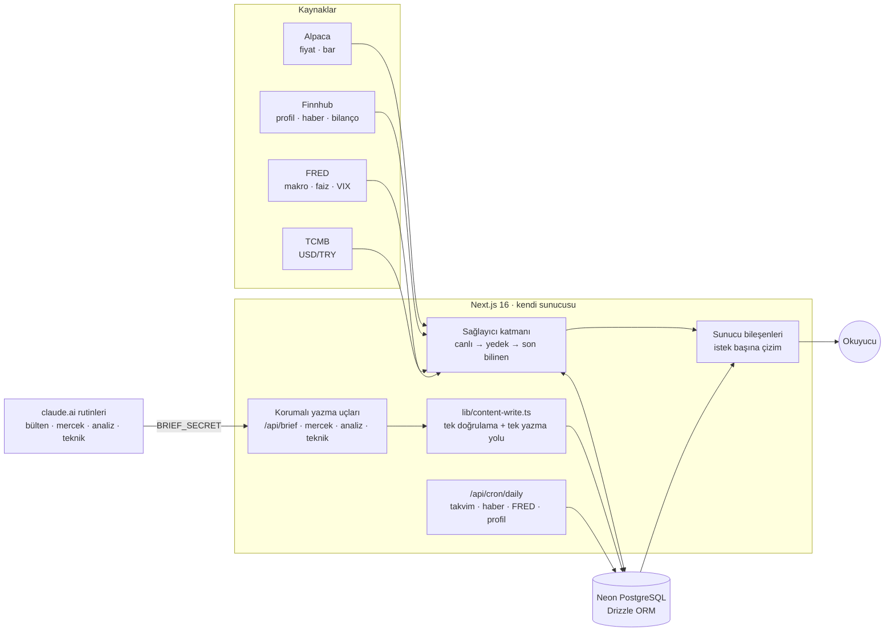

<div align="center">

<a href="https://aciliszili.com"></a>

# Açılış Zili · Opening Bell

**ABD borsaları için Türkçe günlük takip platformu. Zil çalmadan önce bugünü gör.**

[**aciliszili.com**](https://aciliszili.com) · [English](https://aciliszili.com/en) · [Rehber](https://aciliszili.com/rehber) · [Mercek](https://aciliszili.com/mercek)


</div>

---

Ekonomik takvim, bilanço tarihleri, gecikmeli ama damgalı canlı fiyat,
grafikler, makro göstergeler, haber akışı ve kişisel takip listeleri. Hepsi
**Türkiye saatiyle** ve tek ekranda. Üstüne her gün yazılan bir bülten,
olayların arkasındaki mekanizmayı anlatan uzun yazılar, bilanço analizleri ve
günde üç kez yenilenen teknik analizler.

İki dil (TR/EN), açık ve koyu tema, telefondan geniş ekrana tam uyum.
Ücretsiz, reklamsız, açık kaynak.

<table>
<tr>
<td align="center"><b>38</b><br><sub>sayfa rotası</sub></td>
<td align="center"><b>18</b><br><sub>API ucu</sub></td>
<td align="center"><b>18</b><br><sub>veritabanı tablosu</sub></td>
<td align="center"><b>4</b><br><sub>veri sağlayıcısı</sub></td>
<td align="center"><b>5</b><br><sub>içerik rutini</sub></td>
<td align="center"><b>17</b><br><sub>mürekkep sahnesi</sub></td>
<td align="center"><b>2</b><br><sub>dil, her sayfada</sub></td>
</tr>
</table>

## İçindekiler

- [Ne Yapar](#ne-yapar)
- [Bir İşlem Günü: Siteyi Nasıl Kullanırsın](#bir-i̇şlem-günü-siteyi-nasıl-kullanırsın)
- [İki Kurucu Karar](#i̇ki-kurucu-karar)
- [Mimari](#mimari)
- [Teknoloji](#teknoloji)
- [Hareket ve Mürekkep](#hareket-ve-mürekkep)
- [Veri Modeli](#veri-modeli)
- [Sağlayıcılar](#sağlayıcılar)
- [İçerik Üretimi](#i̇çerik-üretimi)
- [Görsel Dil](#görsel-dil)
- [Erişilebilirlik](#erişilebilirlik)
- [Performans](#performans)
- [Gizlilik](#gizlilik)
- [Ekranlar](#ekranlar)
- [Geliştirme](#geliştirme)
- [Deploy](#deploy)
- [Dizin Yapısı](#dizin-yapısı)
- [Bilinen Sınırlar](#bilinen-sınırlar)

---

## Ne Yapar

Altı konu başlığı var ve her biri ayrı bir soruya cevap veriyor.

| | Soru | Nerede |
|---|---|---|
| 📈 | **Piyasa bugün nerede?** Endeksler (S&P 500, Nasdaq 100, Dow, Russell 2000), açılışa geri sayım ve seans şeridi, günün en çok yükselen ve düşenleri, piyasa genişliği ve bileşenlerin ısı haritası, tahvil faizleri ve getiri eğrisi, VIX, dünya piyasaları. | `/` · `/piyasalar` |
| 🏢 | **Bu şirket nasıl gidiyor?** Gün içinden beş yıla grafik (alan ya da mum), profil, değerleme ve risk ölçüleri, 52 hafta bandı, analist dağılımı, haberler, geçmiş bilanço sürprizleri. 1.000'i aşkın şirket sektör şeridiyle ve sıralanabilir bir dizinde; iki ile dört hisse **aynı ölçekte** yan yana. | `/sirketler` · `/hisse/NVDA` · `/karsilastir` |
| 🧾 | **Kim ne zaman bilanço açıklıyor?** Açılış öncesi mi kapanış sonrası mı, analist EPS ve gelir beklentisi ne, gerçekleşen ne çıktı. Takvim `.ics` olarak kendi takvimine eklenebiliyor. Açıklanan çeyrekler için skorlu uzun analizler. | `/bilancolar` |
| 🎯 | **Teknik olarak nereden alınır, nerede vazgeçilir?** On beş hissenin her işlem günü üç kez yenilenen analizi: görüş (Al/Tut/Sat), alım bölgesi, hedefler, stop, destek ve direnç, senaryolar. | `/teknik` |
| 🏛️ | **Ekonomi ne diyor?** CPI, FOMC, istihdam, PCE; takvimde saatleriyle, beklenti ve gerçekleşenle. Altı FRED serisi ve halka arz takvimi. | `/makro` · `/takvim` |
| 📰 | **Bugün ne konuşuluyor, neden?** Siteden çıkmadan okunan haber akışı, her gün yazılan bülten, olayın **mekanizmasını** anlatan Mercek yazıları ve borsayı sıfırdan öğreten sıralı bir rehber. | `/haberler` · `/bulten` · `/mercek` · `/rehber` |

Bir de kişisel taraf var: çoklu takip listeleri, renkli etiketler, ana sayfada
kendi listenin özeti, yalnızca senin izlediklerinin bilanço takvimi ve
hesabını gösteren, sitenin kendi çizdiği on altı profil ikonundan biri ve
yedi renkten biri.

---

## Bir İşlem Günü: Siteyi Nasıl Kullanırsın

Site bir işlem gününün ritmine göre kuruldu. Saatler Türkiye saati; ABD yaz
saatine göre kayıyorlar (kışın açılış 17:30) ve ekranda her zaman o günün
tarihiyle hesaplanıyorlar.

| Saat (TR) | Ne oluyor | Nereye bakarsın |
|---|---|---|
| **09:00** | Dün açıklanan bilançoların analizleri yayında: skor, görüş, hedef fiyat, güçlü yönler ve riskler. | Bilançolar → Analizler |
| **11:30** | Günün ilk Mercek yazısı: bir olayın arkasındaki mekanizma, metinden çizilen grafik ve rakam bloklarıyla. | Mercek |
| **15:45** | Açılış öncesi teknik analiz: on beş hissenin planı güncellendi. | Teknik Analiz |
| **16:10** | Günün bülteni: bugün neye bakmalı, takvimde ne var. | Ana sayfa → Günün Özeti |
| **16:30** | 🔔 **Açılış zili.** Geri sayım sıfırlanır ve zil çalar; endeks kartları, hareket paneli ve gün akışı canlıya geçer. | Ana sayfa |
| **19:45** | Seans içi teknik analiz. | Teknik Analiz |
| **21:45** | Kapanışa doğru teknik analiz. | Teknik Analiz |
| **23:00** | Kapanış zili. Kapanış sonrası bilançolar bu pencerede açıklanır. | Bilançolar |
| **23:30** | Günün ikinci Mercek yazısı. | Mercek |

Pazartesi sabahı 09:30'da bir de haftalık bülten yayımlanıyor.

**Birkaç kısayol:**

- **`⌘K` / `Ctrl K`**: her yerden sembol, şirket, teknik analiz ve yazı arama.
- **Kalp ikonu**: bir hisseyi takip listene ekler; ana sayfada listenin özeti
  ve Bilançolar → Takip Ettiklerim'de yalnızca senin şirketlerin çıkar.
- **Takvime Ekle**: bir bilançoyu `.ics` olarak telefonunun takvimine atar.
- **`/en/...`**: her sayfanın İngilizcesi aynı adreste, önekli.
- **Tema düğmesi**: yeni tema tıkladığın yerden bir mürekkep lekesi gibi yayılır.

---

## İki Kurucu Karar

Ürünün geri kalanı bu iki karardan türüyor.

### Saat Türkiye Saatiyle

Bütün kaynaklar New York saatiyle yayın yapıyor. Bir bilançonun "after the
close" açıklanacağını bilmek yetmiyor; okuyucunun bunu kafasında 23:00'a
çevirmesi gerekiyor ve ABD yaz saati kaydıkça bu dönüşüm yılda iki kez
değişiyor. Bu üründe **birincil saat İstanbul**, New York künyede durur;
İngilizceye geçince sıra tersine döner. Hiçbir yere sabit saat yazılmaz. Tek
kaynak `lib/session-clock.ts`; ET↔UTC dönüşümünün tamamı `lib/market-hours.ts`te.

### Ekranda Uydurma Sayı Yok

Ücretsiz sağlayıcılar dünyayı yarım gösteriyor ve bu proje eksik veriyi
gizlemek yerine **söylemeyi** seçiyor. Veri yoksa kart boş durur. Her kartın
altında `kaynak · saat` damgası vardır. Gecikmeli besleme gecikmeli olduğunu
yazar. Sağlayıcı dakika vermiyorsa saat `~` ile yaklaşık yazılır ve hangi
pencere olduğu adıyla söylenir. Bir metrik dürüstçe gösterilemiyorsa hiç
gösterilmez: Brent kartı bu yüzden kaldırıldı.

Bu ilke animasyona kadar iniyor. Fiyat grafiğinin ucundaki atan nokta
"fiyat hâlâ oynuyor" demek; o yüzden yalnızca seans açıkken ve çizilen gün
seans günüyse atıyor.

---

## Mimari



### Sunucuda İçerik Üreten Model Çağrısı Yok

Sitenin yazılı içeriğini (bülten, Mercek yazıları, bilanço ve teknik
analizler) claude.ai üzerindeki zamanlanmış rutinler üretir ve korumalı
uçlara **yazar**. Sunucu yalnızca veritabanından okur. Yayın gecikirse ekran
en son yazılanı gösterir ve yenisinin ne zaman geleceğini söyler.

Rutin sayı üretmez, yorum yazar: teknik analizde göstergeleri (ortalamalar,
RSI, MACD, hacim, pivotlar) site kendi fiyat verisinden hesaplar ve rutine
verir; gösterge fotoğrafını yazma ucu kendisi çıkarır.

Koddaki tek model çağrısı isteğe bağlı: haber başlığı çevirisinde önce DeepL
denenir, anahtarı verilmişse Claude yedek olarak devreye girer.

### İçeriğin Tek Yazma Yolu

Doğrulama şeması, sürüm fotoğrafı ve upsert `lib/content-write.ts`te.
Rutinlerin uçları da yönetim panelinin editörleri de oradan geçer. Panelden
yeni kayıt üretilmez, yalnızca var olan düzeltilir; üzerine yazılan hâlin
fotoğrafı `story_revisions`a düşer.

### Üç Katmanlı Veri

Her sağlayıcı çağrısı sırayla üç kapıdan geçer: **canlı sağlayıcı → yedek
sağlayıcı → Neon'daki son bilinen değer.** Hiçbir aşamada uydurma değer
üretilmez. Sağlayıcı fonksiyonları `throw` etmez, hatayı değer olarak
döndürür; kart "veri alınamadı" der ve sayfanın geri kalanı çalışmaya devam
eder.

Bir yüzde hangi seansı anlattığını **kanıtlamak** zorunda. Kotasyon ancak
işlem günü `status.sessionDate`e eşitse ve yeterince tazeyse "bugün" sayılır.
Ekran katmanı bayat veriyi künyesiyle gösterebilir; **yazma katmanı
gösteremez.** Bülten, Mercek ve teknik uçlar bayat kotasyonu hiç kullanmaz,
çünkü oradan çıkan sayı metne geçip kalıcı olur.

### Önbellek Sunucuda Paylaşımlı

Kotasyon tazeliği seansa göre değişir: seans içinde 15 saniye, uzatılmış
seansta 60, kapalıyken 15 dakika. Önbellek ziyaretçi başına değil sunucuda
olduğu için sağlayıcıya giden istek trafikle artmıyor.

İstek içinde `cache()` ile tekilleştirme var ve anahtar **sıralanmış sembol
dizesi**: iki panel aynı listeyi sorduğunda sağlayıcıya bir kez gidilir. Bu
hız kadar doğruluk meselesi; ayrı çekilselerdi aynı ekranda aynı hissenin iki
farklı yüzdesi durabilirdi.

### Görseli Metin Çiziyor

Yazıların fotoğrafı yok. Görsel dil, metinden çizilen `:::` bloklarıdır:
model yalnızca satırları yazar, çizimi site yapar.

```
::: sayilar Rakamlarla
%5,31 | 30 yıllık faiz, pazartesi
2007 | bu seviyenin son görüldüğü yıl
:::
```

Yedi görsel blok (`sayilar` · `bar` · `pay` · `akis` · `oncesi` · `zaman` ·
`grafik`) ve dört metin kutusu (`ornek` · `dikkat` · `ozet` · `tanim`) var.
Kazanç üç: telif riski yok, görsel barındırmak gerekmiyor, her temada
tutarlı. Elimizdeki tek gerçek görsel kaynağı şirket logoları.

### Ölçmeden Düzen Değişmiyor

Yerleşim kararları tahminle değil ölçümle veriliyor ve ölçüm kod yorumunda
kalıyor: hangi genişlikte kaç piksel taştığı, hangi CLS değerinin nereden
geldiği, hangi kontrast oranının kaça çıktığı. Kod içi Türkçe yorumlar birer
**karar kaydıdır**: ne yapıldığını değil, neden yapıldığını ve hangi somut
hatanın onu doğurduğunu anlatırlar.

---

## Teknoloji

| Katman | Seçim | Neden |
|---|---|---|
| Framework | **Next.js 16.2** · App Router · Turbopack | Sunucu bileşenleri, akışlı Suspense, sunucu eylemleri |
| UI | **React 19.2** | `useOptimistic`, `useActionState`, form eylemleri |
| Dil | **TypeScript 5**, `strict` | `en` sözlüğü `tr` tipinden türer; eksik çeviri derlenmez |
| Stil | **Tailwind CSS v4** | `tailwind.config` yok; tokenlar `app/globals.css` içindeki `@theme inline` bloğunda |
| Hareket | **Motion 13** (`motion/react`) + Web Animations API + CSS | Panel girişleri, düzen geçişleri, logo uçuşu |
| Çizim | **Canvas 2D** mürekkep motoru (`lib/ink/`) | Tohumlu, deterministik, kare kare saf fonksiyon |
| Grafik | **lightweight-charts 5** (hisse) · elle çizilen SVG (sparkline, karşılaştırma, makale blokları) | |
| Veritabanı | **Neon PostgreSQL** (`@neondatabase/serverless`) + **Drizzle ORM 0.45** | Migration'lar `drizzle/` altında, yalnızca eklenir |
| Doğrulama | **Zod 4** | İçerik yazma yolu ve API uçları |
| Auth | **next-auth v5** · Credentials + bcrypt · JWT | Yönetim yetkisi veritabanında |
| İkon | **Phosphor** (duotone) + sitenin kendi çizdiği profil ikonları | |
| Yazı | **Schibsted Grotesk**, tek aile, değişken 400–900 | Ayrım punto ve ağırlıkla |
| Tema | Custom `data-theme` + `az-theme` çerezi | `next-themes` yok; ilk karede doğru tema |
| Barındırma | Oracle Cloud Always Free · `next start` + systemd · Caddy (TLS) | Her push GitHub Actions ile deploy |
| Doğrulama araçları | `tsx --test` (19 test dosyası) · başsız Chrome (`puppeteer-core`) ölçüm betikleri | |

---

## Hareket ve Mürekkep

Animasyon süs için değil, okumayı kolaylaştırmak için var ve her hareketin
bir işi var. Hepsi `prefers-reduced-motion`a saygı gösterir: azaltılmış
harekette son kare tek seferde basılır.

**Mürekkep sahneleri** (`lib/ink/`, `components/ink/`). Fotoğraf yerine
çizimin ikinci ayağı. Canvas 2D motoru fırça, damla, sıçrama ve kuru fırça
dokusunu tohumlu ve deterministik çiziyor; her sahne `render(ctx, t)` saf
fonksiyonu. Karakter markanın zili: gözleri ve gülümsemesi var. Renkler
temadan (mürekkep ve pirinç). Sahneler görünüme girince bir kez oynar ve
oturur. On yedi sahne var; yerleri şunlar:

- oturumun ilk açılışındaki kısa film
- gezinme beklemesinde hedef sayfaya göre değişen sahne
- 404'te kaybolan zil, hata ekranında devrilen zil
- giriş sayfasında selam veren zil, gün şeridi ve kendini çizen form çerçevesi
- boş durumlar
- Mercek ve rehber yazısının bitiş işareti

Yükleme işareti de aynı zil: iş bitene kadar sallanıp çalıyor, çevresinde
fırçayla çizilmiş pirinç bir yörünge dönüyor ve her vuruşta kıvılcım
sıçrıyor. Gezinme bekleyişinin kartı marka adıyla açılıyor.

**Geçişler.**

- **Logo uçuşu:** bir şirket kartına tıklandığında logo yeni sayfanın
  başlığına kavisli bir yolla uçar ve şirket adı onun inişini bekler.
- **Logo:** başlıktaki zilin üzerine gelince zil sallanır ve iki yanında
  bir ses dalgası büyüyüp söner.
- **Tema değişimi:** yeni tema tıklanan noktadan pürüzlü bir mürekkep lekesi
  olarak yayılır (View Transitions + SVG maske).
- **Veri girişi:** grafik çizgileri kırpmayla açılır, çubuklar sıfırdan uzar,
  halka dilimleri çizilir. Geri sayımın rakamları yuvarlanır, son on saniyede
  atar ve sıfırda zil çalar.

İlk ekranda görünen hiçbir şey hidrasyonda sönüp yeniden gelmez. Bunun
ölçümü `components/motion/PremiumMotion.tsx`te.

---

## Veri Modeli

18 tablo. "Kim yazar" sütunu önemli: bir tablonun tazeliği onu yazanın
ritmine bağlı.

| Tablo | Ne tutar | Kim yazar |
|---|---|---|
| `users` · `watchlists` · `watchlist_items` | Hesap, takip listeleri ve sembolleri | Kullanıcı eylemleri |
| `user_avatars` | Seçilen profil ikonu ve rengi (anahtar olarak) | Kullanıcı eylemi (Ayarlar) |
| `symbols` | Sembol künyesi: ad, borsa, sektör, logo, piyasa değeri, hisse sayısı | Tohum + cron + sayfa isteği |
| `quotes_cache` | Son bilinen fiyat; sağlayıcı düşünce gösterilecek yedek | Sayfa isteği |
| `candles_cache` | Aralık başına bar dizisi | Sayfa isteği |
| `earnings_calendar` | Bilanço takvimi + beklenti/gerçekleşen | Cron |
| `economic_events` | Ekonomik takvim (ET tarih + saat) | Tohum + cron |
| `market_holidays` | NYSE/Nasdaq tatilleri, yarım günde erken kapanış | Yalnız tohum |
| `macro_series` | FRED serisi + son 60 gözlem + sonraki yayın | Tohum + cron |
| `news` | Haber akışı + çevirisi | Cron + hisse sayfası |
| `daily_briefs` | Günlük ve haftalık bülten | claude.ai rutini |
| `stories` | Mercek yazıları | claude.ai rutini |
| `story_revisions` | Düzeltilen içeriğin önceki hâli (son on sürüm) | İçerik yazma yolu |
| `earnings_analyses` | Bilanço analizleri; sayılar **ham** (8.97e9), sunum biçimlendirir | claude.ai rutini |
| `technical_analyses` | Sembol × gün × yayın başına tek satır; metin `copy.{tr,en}`, göstergeler `snapshot` | claude.ai rutini |
| `page_views` | Çerezsiz sayfa ölçümü | İstemci beacon |

Migration disiplini: şema değişince **yeni** migration dosyası üretilir,
eskisi düzenlenmez. Migration'lar deploy'da çalışmaz, elle uygulanır. Bu
yüzden yeni bir özellik mümkünse var olan tabloya sütun eklemek yerine kendi
tablosunu alır: `user_avatars` tablo yokken sessizce baş harflere düşüyor,
yani kod migration'dan önce de güvenle yayında durabiliyor.

---

## Sağlayıcılar

| Sağlayıcı | Ne verir | Not |
|---|---|---|
| **Alpaca** | Fiyat (`/snapshots`, `delayed_sip`) ve tarihsel barlar (`/bars`, `sip`) | 200 istek/dk. Uzun bar cevaplarında `next_page_token` izlenir |
| **Finnhub** | Profil, haber, bilanço takvimi, halka arz, EPS sürprizi, analist dağılımı, metrikler, arama | 60 istek/dk. Grafik barları buradan **alınmaz** |
| **FRED** | Makro seriler, tahvil faizleri, VIX | Yayın kimlikleri seri kimliğinden çalışma anında türetilir |
| **TCMB** | USD/TRY | Anahtarsız; günde tek bülten, veri bülten tarihini taşır |

Alpaca'ya geçiş ölçülerek yapıldı. Bir dönem IEX beslemesi kullanıldı: gerçek
zamanlıydı ama konsolide hacmin yalnızca %2–7'sini görüyordu ve **ön seansta
hiç işlem akmıyordu**. Karşılığında 15 dakikalık gecikme kabul edildi ve
ekranda damgalanıyor.

Finnhub'ın üç tuzağı kodda kayıtlı: `marketCapitalization` milyon cinsinden
ama ana borsanın parasında; `/stock/recommendation` karşılık kotasyonu
döndürebiliyor (TSM → "2330.TW"); hazır `peTTM` geriden gelen bir fiyattan
hesaplandığı için kullanılmıyor.

Ücretsiz katmanda karşılığı olmayan veri elle tohumlanıyor: NYSE tatilleri,
FOMC/CPI/istihdam takvimi, sembol listesi ve endeks bileşimleri.

---

## İçerik Üretimi

| Rutin | Ne zaman (TR) | Nereye |
|---|---|---|
| Günlük bülten | her gün 16:10 | `POST /api/brief` → ana sayfa · Günün Özeti |
| Haftalık bülten | pazartesi 09:30 | `POST /api/brief` (`period: weekly`) → `/bulten` |
| Mercek yazısı | her gün 11:30 ve 23:30 | `POST /api/mercek` → `/mercek` |
| Bilanço analizi | her gün 09:00 | `POST /api/analiz` → `/bilancolar/analizler` |
| Teknik analiz | işlem günleri 15:45, 19:45, 21:45 | `POST /api/teknik` → `/teknik` |

Beşi de `BRIEF_SECRET` ile korunuyor ve her uç yazdığını geri okuyabiliyor
(`?slug=`, `?symbol=&period=`, `?symbol=`). Ayrıca dört `context` ucu rutine
ham veri ve aday listesi veriyor. Prompt'ların tamamı `docs/claude-rutinler.md`
içinde. Rutinler koddan kurulmaz, claude.ai arayüzünden elle kurulur.

---

## Görsel Dil

- **Derinlik tonla kurulur, gölgeyle değil.** Kartlar zeminden saydamlık ve
  tek hairline ile ayrılır; glass ve blur yok.
- **Hardcoded renk yok.** Her renk bir CSS değişkeni; açık ve koyu tema aynı
  token adlarını farklı değerlerle doldurur. Varsayılan tema açık.
- **Tek yazı ailesi.** Ayrım punto ve ağırlıkla. Sayılar için ayrı bir mono
  aile denendi ve geri alındı.
- **Renk anlam taşır.** Yeşil ve kırmızı yalnızca yön söyler; profil
  ikonlarında bile kullanılmaz, çünkü kırmızı bir karo "düşüşte" diye okunur.
- **Karşılaştırılan her büyüklük bir de çizgi olarak okunur.** Piyasa değeri,
  değişim ve F/K gibi sütunların altında ince bir ölçek çubuğu var. Hisse
  fiyatı gibi karşılaştırılamayan bir ölçüde ise çubuk hiç basılmaz.
- **Her ekran aynı sırada:** başlık → künye → ana görsel → ölçü ızgarası →
  metin → künye ve uyarılar → veri damgası.
- **Degrade metin belgeli bir istisna:** yalnızca kısa display metninde,
  `@supports` korumalı ve solid fallback'li.
- **Türkçe Title Case.** Cümle olmayan her metin Title Case. `capitalize`
  yasak, çünkü `i`yi `I` yapıyor, `İ` değil.

---

## Erişilebilirlik

Kod içinde WCAG kriter numaraları geçiyor ve her biri gerçek bir düzeltmeye
bağlı:

- **2.1.1**: yatay kayan tablo kapları klavyeyle odaklanabilir.
- **2.4.1**: atlama bağlantısı ve `<main tabIndex={-1}>`.
- **2.4.11**: sabit katmanlar odağı örtmesin diye `scroll-padding`. Ölçüldü:
  `/haberler`de 99 odaklanabilir öğenin 62'sinin halkası kırpılıyordu.
- **2.5.3**: kısaltmalı denetimlerde erişilebilir ad görünen etiketi kapsar.
- **AA kontrast**: `--text-muted` 3,50 → 5,28; wash üzerine yazılan metin için
  ayrı `--primary-ink` (4,14 → 4,86).
- **Renk tek taşıyıcı değil**: yön her zaman işaretle de söylenir (▲/▼, +/−).
- **Dokunma hedefi** telefonda 44 piksel (`.tap-44` ya da gerçek yükseklik).
- **Canlı bölgeler**: form hataları, kayıt sonuçları ve yükleme durumu ekran
  okuyucuya duyurulur.
- **Hareket**: azaltılmış hareket tercihine saygı; piyasa şeridinde ayrıca
  açık bir duraklat düğmesi.

---

## Performans

- **CLS yapıyla düşürüldü.** Ana sayfanın mobil CLS'i 0,25'ti; dokuz Suspense
  sınırı tek bir elle yazılmış yüksekliği paylaşıyordu. Yer tutucular artık
  yükseklikle değil **yapıyla** eşleşiyor.
- **Boşluk esnetilmez, doldurulur.** İki kolonlu ana sayfada kısa kalan kolon,
  sunucunun `hidden` bastığı yedek satırları tarayıcının ölçümüyle açarak
  dengeleniyor. JavaScript kapalıyken taban satır sayısı kalıyor.
- **Kökte `:has()` yok.** Geri sayım her saniye DOM'a dokunduğu için belge
  kökündeki bir `:has()` 4x yavaş CPU'da yükleme boyunca 2,1 saniye stil
  hesabı yapıyordu (ölçüldü).
- **Canlı veri yalnızca görünen dilime.** Şirketler dizininde piyasa değeri
  sırasında kotasyon bin sembol için değil, görünen dilim artı bir pay için
  çekiliyor.

---

## Gizlilik

Sayfa ölçümü çerezsiz. IP, tam referrer, kullanıcı ajanı ve kullanıcı kimliği
tutulmuyor; günlük dönen bir ziyaretçi özeti saklanıyor ve 180 gün sonra
siliniyor. Üçüncü taraf analitik yok. Kaydedilen her üye alanı
[KVKK metninde](https://aciliszili.com/kvkk) sayılı.

---

## Ekranlar

Rota listesinin **tek kaynağı** burası. 38 sayfa var: 29'u herkese açık, 9'u
yönetim. Hepsi istek başına sunucuda çiziliyor. Her sayfa `/en/...` önekiyle
İngilizce de açılıyor; önek sunucuda sökülüyor ve adres çubuğunda kalıyor.

### Ana Akış

| Rota | Cevapladığı soru |
|---|---|
| `/` | Zil çalmadan önce bugün ne var: geri sayım, endeksler, gün akışı, bülten, Mercek, teknik görünüm, bilançolar, favoriler, haberler |
| `/piyasalar` | Piyasanın nabzı: endeksler, tahvil faizleri, VIX, piyasa genişliği ve ısı haritası, gün içi hareket, endeks bileşenleri |
| `/sirketler` | Hangi şirket hangi sektörde, ne kadar ediyor: sektör şeridi + sıralanabilir dizin |
| `/hisse/[symbol]` | Bu şirket nasıl gidiyor: canlı grafik, profil, metrikler, analistler, haber, beklenti ile gerçekleşeni aynı sütunda gösteren geçmiş bilançolar |
| `/karsilastir` | İki ile dört hisseden hangisi: aynı ölçekte normalize grafik + tek tablo |
| `/makro` | ABD ekonomisi nerede: altı FRED serisi, sonraki açıklama |
| `/takvim` | Hangi makro veri ne zaman: gün/hafta/ay, önem süzgeci, halka arz takvimi |
| `/haberler` · `/haberler/[id]` | Bugün ne konuşuluyor: akış + siteden çıkmadan okuma |

### Bilançolar

Sekme çubuğu paylaşılan bir layout'ta değil, üç sayfanın her biri kendi
basıyor; detay sayfası aynı segmentin altında ve orada sekme istenmiyor.

| Rota | Soru |
|---|---|
| `/bilancolar` | Kim ne zaman açıklıyor: hafta/ay, açılış öncesi ve kapanış sonrası |
| `/bilancolar/analizler` | Okunmuş çeyrekler: skor, görüş, hedef fiyat |
| `/bilancolar/takip` | Benim izlediklerimin bilançoları |
| `/bilancolar/[symbol]/[period]` | Bu çeyrek ne anlattı: tam analiz |

### Teknik Analiz

Başlıkta Piyasalar'dan hemen sonra; mobilde Menü'den.

| Rota | Soru |
|---|---|
| `/teknik` | On beş hisse bugün teknik olarak nerede: görüş halkası, plan şeridi, risk/getiri rayı |
| `/teknik/[symbol]` | Nereden alınır, nerede satılır, nerede vazgeçilir: plan, fiyat haritası, gösterge panelleri, senaryolar, görüş geçmişi |

### Okuma

| Rota | Soru |
|---|---|
| `/mercek` · `/mercek/[slug]` | Olayın arkasındaki mekanizma neydi |
| `/rehber` · `/rehber/[slug]` | Borsayı nereden öğrenirim: sıralı müfredat |
| `/bulten` · `/bulten/[tarih]` · `/bulten/haftalik` · `/bulten/haftalik/[tarih]` | Dünkü ya da geçen haftaki bülten; her sayının kalıcı adresi var |

### Hesap

`/giris` · `/kayit` · `/favoriler` · `/ayarlar` (profil ikonu ve rengi, tema, dil,
hesap silme) · `/menu` · `/kvkk`

### Yönetim

Kabuğun dışında: `/admin`, `/admin/trafik`, `/admin/uyeler`,
`/admin/icerik`, `/admin/yazilar` ve iki editör
(`/admin/yazilar/mercek/[slug]`, `/admin/yazilar/bulten/[tarih]`). Panel
sekmelerinden **İçerik ölçer, Yazılar değiştirir.** Yetki veritabanında;
yetkisiz istek **404** görür, çünkü "yetkiniz yok" demek panelin varlığını ele
verirdi.

Editörler yazarken önizliyor: gövde yayındaki çizimin kendisiyle sunucuda
çiziliyor, başlık ve giriş tuşa basıldığı an önizlemenin başında değişiyor.
Tarih alanları tarayıcının yerel takvimi yerine sitenin kendi seçicisini
kullanıyor (klavyeyle gezilebilir, aralık dışı günler seçilemez).

---

## Geliştirme

```bash
npm install
cp .env.example .env.local   # değerleri doldur, aşağıya bak
npm run db:migrate           # şemayı Neon'a uygula
npm run db:seed              # takvim + tatil + sembol tohumları
npm run build                # ilk kez: route tiplerini üretir
npm run dev
```

**Temiz bir kopyada önce `npm run build` çalıştır.** `PageProps` ve
`RouteContext` tipleri `.next/types` altına üretiliyor; build almadan
`typecheck` onlarca yanlış hata verir.

<details>
<summary><b>Ortam değişkenleri</b></summary>

| Değişken | Zorunlu | Nereden |
|---|---|---|
| `DATABASE_URL` | evet | [neon.tech](https://neon.tech) → connection string |
| `AUTH_SECRET` | evet | `openssl rand -base64 32` |
| `ALPACA_API_KEY_ID` + `ALPACA_API_SECRET_KEY` | fiyat için | [alpaca.markets](https://alpaca.markets) (paper yeterli) |
| `FINNHUB_API_KEY` | profil/haber için | [finnhub.io](https://finnhub.io) |
| `FRED_API_KEY` | makro için | [fred.stlouisfed.org](https://fred.stlouisfed.org/docs/api/api_key.html) |
| `CRON_SECRET` | üretimde | `openssl rand -hex 32`; cron ucunun `Bearer` anahtarı |
| `BRIEF_SECRET` | içerik için | `openssl rand -hex 32`; rutin uçlarının kapısı |
| `NEXT_PUBLIC_SITE_URL` | üretimde | yayın adresi (OG görselleri, sitemap) |
| `AUTH_TRUST_HOST` | üretimde | ters vekil arkasında `true` |
| `SITE_INDEXABLE` | ikinci kopyada | canlıda `true`, ikinci kopyada `false` |
| `DEEPL_API_KEY` | opsiyonel | haber başlığı çevirisi (önce bu denenir) |
| `ANTHROPIC_API_KEY` | opsiyonel | haber başlığı çevirisinde yedek |
| `ANALYTICS_SALT` | opsiyonel | ziyaretçi özetinin tuzu; yoksa `AUTH_SECRET` |

Anahtarlar olmadan da uygulama açılır; ilgili kartlar "veri alınamadı" der ve
sayfa çökmez. Kontrol için `/api/debug/providers`. Korumalı uçlar yerelde
secret boşsa açıktır; **üretimde secret yoksa uç 503 döner.**

</details>

<details>
<summary><b>Komutlar</b></summary>

```bash
npm run dev            # geliştirme (3000 doluysa 3001)
npm run build          # üretim derlemesi
npm run typecheck      # tsc --noEmit
npm run lint           # eslint
npx tsx --test tests/*.test.ts   # birim testleri
npm run db:generate    # şema değişti → YENİ migration dosyası
npm run db:migrate     # migration'ları uygula
npm run db:seed        # idempotent tohum (kullanıcı verisine dokunmaz)
npm run db:studio      # Drizzle Studio
npm run build:favicon  # .ico ve PWA ikonlarını marka işaretinden üret
```

</details>

### Doğrulama

1. **`typecheck` + `lint` + `build`**: üçü de temiz olmadan commit yok.
2. **Birim testleri**: `tests/` altında 19 dosya. Kotasyon tazeliği ve paket
   yaşı, önbellek süreleri, rutin ve teknik yayın saatleri, karşılaştırma
   ölçeği, gün akışı, mali çeyrek hesabı, rota sahneleri gibi saf mantığı
   sınıyor.
3. **Ölçüm**: başsız Chrome rota × genişlik matrisini (360 / 390 / 768 / 1280 /
   1440) tarıyor; yatay taşma, konsol hatası ve düzen gerçek piksellerle
   ölçülüyor ve sonuç kod yorumuna yazılıyor. Bu betikler `.tmp-*.mjs`
   deseniyle yazılır ve commit'lenmez.

---

## Deploy

Site kendi sunucusunda yayında: [aciliszili.com](https://aciliszili.com).
Tam yol `docs/deploy-vps.md`'de, sunucu dosyaları `deploy/` altında.

1. `main`'e her push **GitHub Actions**'ı tetikler
   (`.github/workflows/deploy.yml`): runner'da typecheck + lint + build.
2. Geçerse sunucuda `deploy/update.sh` çalışır: yeni sürüm
   `releases/<zaman>-<sha>` altına derlenir, `current` bağı ancak sağlık
   kontrolü geçince çevrilir. Derleme sürerken canlı sürüm ayakta kalır,
   sağlık geçmezse bağ öncekine döner.
3. Günlük cron (`/api/cron/daily`, hafta içi 10:30 UTC) sunucunun crontab'ından
   tetiklenir. Yüz saniyelik bir bütçesi var; dolarsa kalan adımları atlar ve
   neyi atladığını raporlar.

Migration'lar deploy'da **uygulanmaz**; şema değişikliği ayrıca
`npm run db:migrate` ile üretim veritabanına uygulanır.

İkinci bir kopya açılırsa iki kural: **cron tek yerde çalışır** (Finnhub'ın
dakikalık kotası) ve **ikinci kopya indekslenmez** (`SITE_INDEXABLE=false`).

---

## Dizin Yapısı

```
app/
  (app)/             # sayfalar: bugün, piyasalar, şirketler, hisse, karşılaştır,
                     #   takvim, bilançolar, teknik, mercek, rehber, bülten, haberler, hesap
  admin/             # yönetim: kabuğun dışında, yetkisizde 404
  actions/           # sunucu eylemleri: auth, takip listesi, içerik, profil ikonu
  api/               # chart, day-flow, karsilastir, search, takvim, olcum,
                     #   brief, mercek, analiz, teknik (+ context), cron, auth, debug
components/
  article/           # ArticleBody: ::: blok ailesi burada çizilir
  brand/             # BellMark (marka işareti) · AvatarIcon (profil ikonları)
  ink/               # InkCanvas, açılış, yükleme ve sahne yerleşimleri
  motion/            # görünüme girme sistemi, logo uçuşu, sayfa geçişleri
  layout/            # AppShell, başlık, alt sekme çubuğu, piyasa şeridi, arama
  today/             # geri sayım, gün akışı, bülten, kolon doldurucu
  markets/           # karşılaştırma, ölçek çubukları, piyasa nabzı
  stock/ earnings/ stories/ technical/ watchlist/ auth/ ui/
lib/
  ink/               # mürekkep motoru (engine) + sahneler (scenes) + rota haritası
  market-hours.ts    # ET↔UTC, seans durumu, önbellek süreleri
  session-clock.ts   # dile göre birincil saat dilimi (TR/NY)
  content-write.ts   # içeriğin tek doğrulama ve yazma yolu
  compare.ts         # karşılaştırma ekranının ortak sözleşmesi
  technical*.ts      # teknik analiz: semboller, göstergeler, yazma yolu
  avatars.ts         # profil ikonu ve renk anahtarları
  providers/         # alpaca · finnhub · fred · tcmb
  i18n/              # tr + en sözlükleri (en, tr tipinden türer)
content/guide/       # rehber yazıları: meta + tr + en
db/seed/             # tatiller, ekonomik takvim, semboller, endeks bileşimleri
docs/                # rutin prompt'ları, deploy, tasarım notları
drizzle/             # migration'lar: elle düzenlenmez, yenisi eklenir
tests/               # birim testleri (tsx --test)
```

---

## Bilinen Sınırlar

- **Fiyatlar 15 dakika gecikmeli.** Alpaca'nın ücretsiz katmanı konsolide
  tape'i (SIP) gecikmeli veriyor; ekranda damgalanır.
- **Endeksler ETF üzerinden izlenir** (SPY/QQQ/DIA/IWM) ve arayüzde yazılır.
- **Dünya piyasaları MSCI ülke fonları üzerinden.** Yön aynı, yüzde kur ve
  seans farkıyla ayrışabilir.
- **Emtia yok.** Ücretsiz sağlayıcıların hiçbirinde canlı emtia fiyatı yok.
- **Bilanço saatleri yaklaşık.** Sağlayıcı yalnızca pencereyi veriyor.
- **Ekonomik takvim tohumlanır** ve FRED'in yayın takvimiyle ileriye uzatılır.

---

<div align="center">

Kişisel bir proje. **Yatırım tavsiyesi değildir.** Veriler üçüncü taraf
sağlayıcılardan gelir, gecikmeli ya da hatalı olabilir; ekrandaki hiçbir sayı
bir alım satım kararının tek dayanağı olacak şekilde tasarlanmadı.

[aciliszili.com](https://aciliszili.com) · [Ahmet Akyapı](https://ahmetakyapi.com)

</div>
