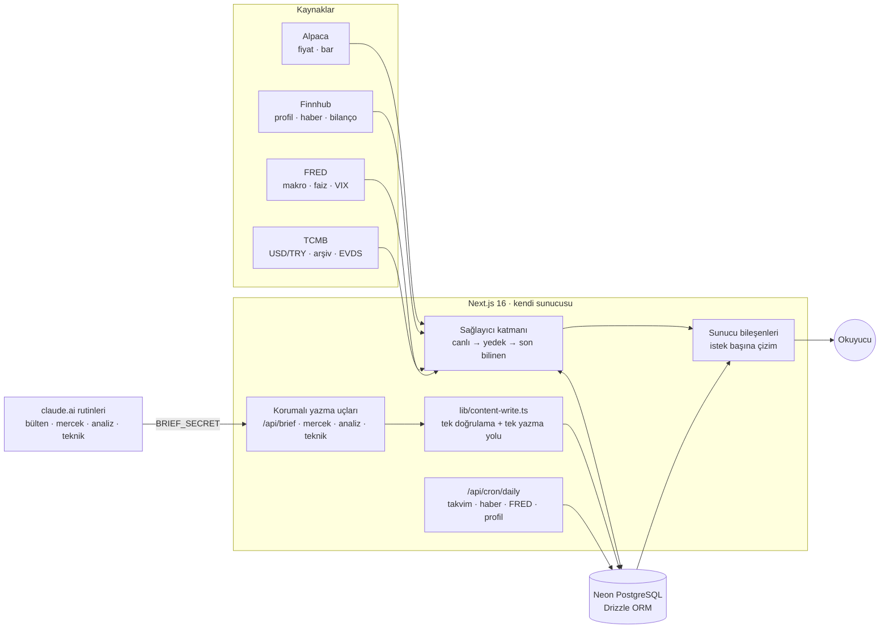

<div align="center">

<a href="https://aciliszili.com"></a>

# Açılış Zili · Opening Bell

**ABD borsaları için Türkçe günlük takip platformu. Zil çalmadan önce bugünü gör.**

[**aciliszili.com**](https://aciliszili.com) · [English](https://aciliszili.com/en) · [Rehber](https://aciliszili.com/rehber) · [Mercek](https://aciliszili.com/mercek)


</div>

---

Ekonomik takvim, bilanço tarihleri, gecikmeli ama damgalı canlı fiyat,
grafikler, makro göstergeler, haber akışı ve kişisel takip listeleri. Hepsi
**Türkiye saatiyle** ve tek ekranda. Üstüne her gün yazılan bir bülten,
olayların arkasındaki mekanizmayı anlatan uzun yazılar, bilanço analizleri ve
günde üç kez yenilenen teknik analizler.

İki dil (TR/EN), açık ve koyu tema, telefondan geniş ekrana tam uyum.
Ücretsiz, reklamsız, açık kaynak.

<table>
<tr>
<td align="center"><b>49</b><br><sub>sayfa rotası</sub></td>
<td align="center"><b>24</b><br><sub>API ucu</sub></td>
<td align="center"><b>22</b><br><sub>veritabanı tablosu</sub></td>
<td align="center"><b>5</b><br><sub>veri sağlayıcısı</sub></td>
<td align="center"><b>5</b><br><sub>içerik rutini</sub></td>
<td align="center"><b>17</b><br><sub>mürekkep sahnesi</sub></td>
<td align="center"><b>2</b><br><sub>dil, her sayfada</sub></td>
</tr>
</table>

## İçindekiler

- [Ne Yapar](#ne-yapar)
- [Bir İşlem Günü: Siteyi Nasıl Kullanırsın](#bir-i̇şlem-günü-siteyi-nasıl-kullanırsın)
- [İki Kurucu Karar](#i̇ki-kurucu-karar)
- [Mimari](#mimari)
- [Teknoloji](#teknoloji)
- [Hareket ve Mürekkep](#hareket-ve-mürekkep)
- [Veri Modeli](#veri-modeli)
- [Sağlayıcılar](#sağlayıcılar)
- [İçerik Üretimi](#i̇çerik-üretimi)
- [Görsel Dil](#görsel-dil)
- [Erişilebilirlik](#erişilebilirlik)
- [Performans](#performans)
- [Gizlilik](#gizlilik)
- [Ekranlar](#ekranlar)
- [Geliştirme](#geliştirme)
- [Deploy](#deploy)
- [Dizin Yapısı](#dizin-yapısı)
- [Bilinen Sınırlar](#bilinen-sınırlar)

---

## Ne Yapar

Sekiz konu başlığı var ve her biri ayrı bir soruya cevap veriyor.

| | Soru | Nerede |
|---|---|---|
| 📈 | **Piyasa bugün nerede?** Endeksler (S&P 500, Nasdaq 100, Dow, Russell 2000), açılışa geri sayım ve seans şeridi, günün en çok yükselen ve düşenleri, piyasa genişliği ve bileşenlerin ısı haritası, tahvil faizleri ve getiri eğrisi, VIX, dünya piyasaları. Bileşenleri ekranda açık duran bir Piyasa Nabzı, on bir SPDR fonuyla sektör performansı, emtia ve kripto fonları. | `/` · `/piyasalar` |
| 🏢 | **Bu şirket nasıl gidiyor?** Gün içinden beş yıla grafik (alan ya da mum; USD, TL ya da Reel TL), profil, değerleme ve risk ölçüleri, sektör yüzdelikli skor kartı, 52 hafta bandı, analist dağılımı ve aydan aya değişimi, içeriden işlemler, bilanço öncesi beklenen hareket, temettü, haberler, geçmiş bilanço sürprizleri. 1.000'i aşkın şirket sektör şeridiyle ve sıralanabilir bir dizinde; iki ile dört hisse **aynı ölçekte** yan yana, yirmi hazır çift ve on tematik liste. | `/sirketler` · `/hisse/NVDA` · `/karsilastir` · `/tema` |
| 🧾 | **Kim ne zaman bilanço açıklıyor?** Açılış öncesi mi kapanış sonrası mı, analist EPS ve gelir beklentisi ne, gerçekleşen ne çıktı. Takvim `.ics` olarak kendi takvimine eklenebiliyor, haftası paylaşılabilir bir görsel olarak iniyor. Açıklanan çeyrekler için skorlu uzun analizler, başında "30 Saniyede" özeti, segment ve KPI verisi. | `/bilancolar` · `/bilancolar/hafta` |
| 🎯 | **Teknik olarak nereden alınır, nerede vazgeçilir?** On beş hissenin her işlem günü üç kez yenilenen analizi: görüş (Al/Tut/Sat), alım bölgesi, hedefler, stop, destek ve direnç, senaryolar. Listede olmayan hisselerde yorumsuz bir teknik fotoğraf. | `/teknik` |
| 🧭 | **Ünlü yatırımcılar ne alıp satıyor?** Buffett, Burry, Ackman, Cathie Wood, Dalio ve on bir ismin SEC 13F bildirimlerinden portföyü, bu çeyrek yeni aldıkları, artırdıkları, azalttıkları ve tamamen sattıkları (adet farkıyla, bölünme ayıklanarak); Nancy Pelosi'nin Kongre işlem bildirimleri tutar aralığıyla. Hisse sayfasında "bu hisseyi kim tutuyor". | `/yatirimcilar` |
| 🏛️ | **Ekonomi ne diyor?** CPI, FOMC, istihdam, PCE; takvimde saatleriyle, beklenti ve gerçekleşenle. On bir FRED serisi, sonraki FOMC kararı, halka arz ve temettü takvimi. | `/makro` · `/takvim` |
| 📰 | **Bugün ne konuşuluyor, neden?** Siteden çıkmadan okunan haber akışı, her gün yazılan bülten, olayın **mekanizmasını** anlatan Mercek yazıları, borsayı sıfırdan öğreten sıralı bir rehber ve yüz elli terimlik bir sözlük. | `/haberler` · `/bulten` · `/mercek` · `/rehber` · `/sozluk` |
| 🇹🇷 | **Türkiye'den yatırım yapınca lirada ne kaldı?** TCMB kuruyla TL ve (EVDS anahtarı varsa) enflasyondan arındırılmış Reel TL getirisi; yurt dışı hisse vergisi hesaplayıcısı (satış kazancı, Yİ-ÜFE endekslemesi, temettü ve stopaj mahsubu) ve TL maliyetli portföy. | `/vergi` · `/portfoy` |

Bir de kişisel taraf var: çoklu takip listeleri, renkli etiketler, ana sayfada
kendi listenin özeti, yalnızca senin izlediklerinin bilanço takvimi,
alış günü kuruyla TL kâr/zarar tutan bir portföy, hesabındaki her şeyi tek
dosyada indiren "Verilerimi İndir" ve hesabını gösteren, sitenin kendi
çizdiği on altı profil ikonundan biri ve yedi renkten biri.

---

## Bir İşlem Günü: Siteyi Nasıl Kullanırsın

Site bir işlem gününün ritmine göre kuruldu. Saatler Türkiye saati; ABD yaz
saatine göre kayıyorlar (kışın açılış 17:30) ve ekranda her zaman o günün
tarihiyle hesaplanıyorlar.

| Saat (TR) | Ne oluyor | Nereye bakarsın |
|---|---|---|
| **09:00** | Dün açıklanan bilançoların analizleri yayında: skor, görüş, hedef fiyat, güçlü yönler ve riskler. | Bilançolar → Analizler |
| **11:30** | Günün ilk Mercek yazısı: bir olayın arkasındaki mekanizma, metinden çizilen grafik ve rakam bloklarıyla. | Mercek |
| **15:45** | Açılış öncesi teknik analiz: on beş hissenin planı güncellendi. | Teknik Analiz |
| **16:10** | Günün bülteni: bugün neye bakmalı, takvimde ne var. | Ana sayfa → Günün Özeti |
| **16:30** | 🔔 **Açılış zili.** Geri sayım sıfırlanır ve zil çalar; endeks kartları, hareket paneli ve gün akışı canlıya geçer. | Ana sayfa |
| **19:45** | Seans içi teknik analiz. | Teknik Analiz |
| **21:45** | Kapanışa doğru teknik analiz. | Teknik Analiz |
| **23:00** | Kapanış zili. Kapanış sonrası bilançolar bu pencerede açıklanır. | Bilançolar |
| **23:30** | Günün ikinci Mercek yazısı. | Mercek |

Pazartesi sabahı 09:30'da bir de haftalık bülten yayımlanıyor.

**Birkaç kısayol:**

- **`⌘K` / `Ctrl K`**: her yerden sembol, şirket, teknik analiz ve yazı arama.
- **Kalp ikonu**: bir hisseyi takip listene ekler; ana sayfada listenin özeti
  ve Bilançolar → Takip Ettiklerim'de yalnızca senin şirketlerin çıkar.
- **Takvime Ekle**: bir bilançoyu `.ics` olarak telefonunun takvimine atar.
- **`/en/...`**: her sayfanın İngilizcesi aynı adreste, önekli.
- **Tema düğmesi**: yeni tema tıkladığın yerden bir mürekkep lekesi gibi yayılır.

---

## İki Kurucu Karar

Ürünün geri kalanı bu iki karardan türüyor.

### Saat Türkiye Saatiyle

Bütün kaynaklar New York saatiyle yayın yapıyor. Bir bilançonun "after the
close" açıklanacağını bilmek yetmiyor; okuyucunun bunu kafasında 23:00'a
çevirmesi gerekiyor ve ABD yaz saati kaydıkça bu dönüşüm yılda iki kez
değişiyor. Bu üründe **birincil saat İstanbul**, New York künyede durur;
İngilizceye geçince sıra tersine döner. Hiçbir yere sabit saat yazılmaz. Tek
kaynak `lib/session-clock.ts`; ET↔UTC dönüşümünün tamamı `lib/market-hours.ts`te.

### Ekranda Uydurma Sayı Yok

Ücretsiz sağlayıcılar dünyayı yarım gösteriyor ve bu proje eksik veriyi
gizlemek yerine **söylemeyi** seçiyor. Veri yoksa kart boş durur. Her kartın
altında `kaynak · saat` damgası vardır. Gecikmeli besleme gecikmeli olduğunu
yazar. Sağlayıcı dakika vermiyorsa saat `~` ile yaklaşık yazılır ve hangi
pencere olduğu adıyla söylenir. Bir metrik dürüstçe gösterilemiyorsa hiç
gösterilmez: Brent kartı bu yüzden kaldırıldı.

Bu ilke animasyona kadar iniyor. Fiyat grafiğinin ucundaki atan nokta
"fiyat hâlâ oynuyor" demek; o yüzden yalnızca seans açıkken ve çizilen gün
seans günüyse atıyor.

---

## Mimari


```mermaid
flowchart LR
  subgraph Kaynaklar
    AL[Alpaca<br/>fiyat · bar]
    FH[Finnhub<br/>profil · haber · bilanço]
    FR[FRED<br/>makro · faiz · VIX]
    TC[TCMB<br/>USD/TRY · arşiv · EVDS]
  end

  subgraph Sunucu["Next.js 16 · kendi sunucusu"]
    PL["Sağlayıcı katmanı<br/>canlı → yedek → son bilinen"]
    RSC["Sunucu bileşenleri<br/>istek başına çizim"]
    API["Korumalı yazma uçları<br/>/api/brief · mercek · analiz · teknik"]
    CW["lib/content-write.ts<br/>tek doğrulama + tek yazma yolu"]
    CRON["/api/cron/daily<br/>takvim · haber · FRED · profil"]
  end

  DB[(Neon PostgreSQL<br/>Drizzle ORM)]
  RT["claude.ai rutinleri<br/>bülten · mercek · analiz · teknik"]
  U((Okuyucu))

  AL & FH & FR & TC --> PL
  PL <--> DB
  PL --> RSC
  RT -- "BRIEF_SECRET" --> API --> CW --> DB
  CRON --> DB
  DB --> RSC --> U
```

### Sunucuda İçerik Üreten Model Çağrısı Yok

Sitenin yazılı içeriğini (bülten, Mercek yazıları, bilanço ve teknik
analizler) claude.ai üzerindeki zamanlanmış rutinler üretir ve korumalı
uçlara **yazar**. Sunucu yalnızca veritabanından okur. Yayın gecikirse ekran
en son yazılanı gösterir ve yenisinin ne zaman geleceğini söyler.

Rutin sayı üretmez, yorum yazar: teknik analizde göstergeleri (ortalamalar,
RSI, MACD, hacim, pivotlar) site kendi fiyat verisinden hesaplar ve rutine
verir; gösterge fotoğrafını yazma ucu kendisi çıkarır.

Koddaki tek model çağrısı isteğe bağlı: haber başlığı çevirisinde önce DeepL
denenir, anahtarı verilmişse Claude yedek olarak devreye girer.

### İçeriğin Tek Yazma Yolu

Doğrulama şeması, sürüm fotoğrafı ve upsert `lib/content-write.ts`te.
Rutinlerin uçları da yönetim panelinin editörleri de oradan geçer. Panelden
yeni kayıt üretilmez, yalnızca var olan düzeltilir; üzerine yazılan hâlin
fotoğrafı `story_revisions`a düşer.

### Üç Katmanlı Veri

Her sağlayıcı çağrısı sırayla üç kapıdan geçer: **canlı sağlayıcı → yedek
sağlayıcı → Neon'daki son bilinen değer.** Hiçbir aşamada uydurma değer
üretilmez. Sağlayıcı fonksiyonları `throw` etmez, hatayı değer olarak
döndürür; kart "veri alınamadı" der ve sayfanın geri kalanı çalışmaya devam
eder.

Bir yüzde hangi seansı anlattığını **kanıtlamak** zorunda. Kotasyon ancak
işlem günü `status.sessionDate`e eşitse ve yeterince tazeyse "bugün" sayılır.
Ekran katmanı bayat veriyi künyesiyle gösterebilir; **yazma katmanı
gösteremez.** Bülten, Mercek ve teknik uçlar bayat kotasyonu hiç kullanmaz,
çünkü oradan çıkan sayı metne geçip kalıcı olur.

### Önbellek Sunucuda Paylaşımlı

Kotasyon tazeliği seansa göre değişir: seans içinde 15 saniye, uzatılmış
seansta 60, kapalıyken 15 dakika. Önbellek ziyaretçi başına değil sunucuda
olduğu için sağlayıcıya giden istek trafikle artmıyor.

İstek içinde `cache()` ile tekilleştirme var ve anahtar **sıralanmış sembol
dizesi**: iki panel aynı listeyi sorduğunda sağlayıcıya bir kez gidilir. Bu
hız kadar doğruluk meselesi; ayrı çekilselerdi aynı ekranda aynı hissenin iki
farklı yüzdesi durabilirdi.

### Görseli Metin Çiziyor

Yazıların fotoğrafı yok. Görsel dil, metinden çizilen `:::` bloklarıdır:
model yalnızca satırları yazar, çizimi site yapar.

```
::: sayilar Rakamlarla
%5,31 | 30 yıllık faiz, pazartesi
2007 | bu seviyenin son görüldüğü yıl
:::
```

Yedi görsel blok (`sayilar` · `bar` · `pay` · `akis` · `oncesi` · `zaman` ·
`grafik`) ve dört metin kutusu (`ornek` · `dikkat` · `ozet` · `tanim`) var.
Kazanç üç: telif riski yok, görsel barındırmak gerekmiyor, her temada
tutarlı. Elimizdeki gerçek görsel kaynağı şirket logoları.

Tek belgeli istisna ünlü yatırımcıların portreleri. Önce Wikimedia
Commons'taki kamu malı ya da CC BY / CC BY-SA lisanslı dosyalar
kullanılıyor, lisansları tek tek okunarak. Özgür portresi olmayan kişilerin
karesi, sahibinin telif riskini bilerek kabul etmesiyle, kurumlarının ya da
kendilerinin herkese açık sayfalarından alındı; künyede lisans değil
yalnızca yayımlayan ve kaynak yazıyor. Hepsi kare kırpılıp
`public/investors/` altında yerelde barındırılıyor (kayıt
`lib/investors.ts` → PORTRAITS). Karesi olmayan ya da kaldırılan kişi,
hikâyesinden gelen bir amblem karosuyla çiziliyor; fotoğraf üretilmiyor.

### Ölçmeden Düzen Değişmiyor

Yerleşim kararları tahminle değil ölçümle veriliyor ve ölçüm kod yorumunda
kalıyor: hangi genişlikte kaç piksel taştığı, hangi CLS değerinin nereden
geldiği, hangi kontrast oranının kaça çıktığı. Kod içi Türkçe yorumlar birer
**karar kaydıdır**: ne yapıldığını değil, neden yapıldığını ve hangi somut
hatanın onu doğurduğunu anlatırlar.

---

## Teknoloji

| Katman | Seçim | Neden |
|---|---|---|
| Framework | **Next.js 16.2** · App Router · Turbopack | Sunucu bileşenleri, akışlı Suspense, sunucu eylemleri |
| UI | **React 19.2** | `useOptimistic`, `useActionState`, form eylemleri |
| Dil | **TypeScript 5**, `strict` | `en` sözlüğü `tr` tipinden türer; eksik çeviri derlenmez |
| Stil | **Tailwind CSS v4** | `tailwind.config` yok; tokenlar `app/globals.css` içindeki `@theme inline` bloğunda |
| Hareket | **Motion 13** (`motion/react`) + Web Animations API + CSS | Panel girişleri, düzen geçişleri, logo uçuşu |
| Çizim | **Canvas 2D** mürekkep motoru (`lib/ink/`) | Tohumlu, deterministik, kare kare saf fonksiyon |
| Grafik | **lightweight-charts 5** (hisse) · elle çizilen SVG (sparkline, karşılaştırma, makale blokları) | |
| Veritabanı | **Neon PostgreSQL** (`@neondatabase/serverless`) + **Drizzle ORM 0.45** | Migration'lar `drizzle/` altında, yalnızca eklenir |
| Doğrulama | **Zod 4** | İçerik yazma yolu ve API uçları |
| Auth | **next-auth v5** · Credentials + bcrypt · JWT | Yönetim yetkisi veritabanında |
| İkon | **Phosphor** (duotone) + sitenin kendi çizdiği profil ikonları | |
| Yazı | **Schibsted Grotesk**, tek aile, değişken 400–900 | Ayrım punto ve ağırlıkla |
| Tema | Custom `data-theme` + `az-theme` çerezi | `next-themes` yok; ilk karede doğru tema |
| Barındırma | Oracle Cloud Always Free · `next start` + systemd · Caddy (TLS) | Her push GitHub Actions ile deploy |
| Doğrulama araçları | `tsx --test` (41 test dosyası) · başsız Chrome (`puppeteer-core`) duman testi ve ölçüm betikleri | |

---

## Hareket ve Mürekkep

Animasyon süs için değil, okumayı kolaylaştırmak için var ve her hareketin
bir işi var. Hepsi `prefers-reduced-motion`a saygı gösterir: azaltılmış
harekette son kare tek seferde basılır.

**Mürekkep sahneleri** (`lib/ink/`, `components/ink/`). Fotoğraf yerine
çizimin ikinci ayağı. Canvas 2D motoru fırça, damla, sıçrama ve kuru fırça
dokusunu tohumlu ve deterministik çiziyor; her sahne `render(ctx, t)` saf
fonksiyonu. Karakter markanın zili: gözleri ve gülümsemesi var. Renkler
temadan (mürekkep ve pirinç). Sahneler görünüme girince bir kez oynar ve
oturur. On yedi sahne var; yerleri şunlar:

- oturumun ilk açılışındaki kısa film
- gezinme beklemesinde hedef sayfaya göre değişen sahne
- 404'te kaybolan zil, hata ekranında devrilen zil
- giriş sayfasında selam veren zil, gün şeridi ve kendini çizen form çerçevesi
- boş durumlar
- Mercek ve rehber yazısının bitiş işareti

Yükleme işareti de aynı zil: iş bitene kadar sallanıp çalıyor, çevresinde
fırçayla çizilmiş pirinç bir yörünge dönüyor ve her vuruşta kıvılcım
sıçrıyor. Gezinme bekleyişinin kartı marka adıyla açılıyor.

**Geçişler.**

- **Logo uçuşu:** bir şirket kartına tıklandığında logo yeni sayfanın
  başlığına kavisli bir yolla uçar ve şirket adı onun inişini bekler.
- **Logo:** başlıktaki zilin üzerine gelince zil sallanır ve iki yanında
  bir ses dalgası büyüyüp söner.
- **Tema değişimi:** yeni tema tıklanan noktadan pürüzlü bir mürekkep lekesi
  olarak yayılır (View Transitions + SVG maske).
- **Veri girişi:** grafik çizgileri kırpmayla açılır, çubuklar sıfırdan uzar,
  halka dilimleri çizilir. Geri sayımın rakamları yuvarlanır, son on saniyede
  atar ve sıfırda zil çalar.

İlk ekranda görünen hiçbir şey hidrasyonda sönüp yeniden gelmez. Bunun
ölçümü `components/motion/PremiumMotion.tsx`te.

---

## Veri Modeli

27 tablo. "Kim yazar" sütunu önemli: bir tablonun tazeliği onu yazanın
ritmine bağlı.

| Tablo | Ne tutar | Kim yazar |
|---|---|---|
| `users` · `watchlists` · `watchlist_items` | Hesap, takip listeleri ve sembolleri | Kullanıcı eylemleri |
| `user_avatars` | Seçilen profil ikonu ve rengi (anahtar olarak) | Kullanıcı eylemi (Ayarlar) |
| `symbols` | Sembol künyesi: ad, borsa, sektör, logo, piyasa değeri, hisse sayısı | Tohum + cron + sayfa isteği |
| `quotes_cache` | Son bilinen fiyat; sağlayıcı düşünce gösterilecek yedek | Sayfa isteği |
| `candles_cache` | Aralık başına bar dizisi | Sayfa isteği |
| `earnings_calendar` | Bilanço takvimi + beklenti/gerçekleşen | Cron |
| `economic_events` | Ekonomik takvim (ET tarih + saat) | Tohum + cron |
| `market_holidays` | NYSE/Nasdaq tatilleri, yarım günde erken kapanış | Yalnız tohum |
| `macro_series` | FRED serisi + son 60 gözlem + sonraki yayın | Tohum + cron |
| `news` | Haber akışı + çevirisi | Cron + hisse sayfası |
| `daily_briefs` | Günlük ve haftalık bülten | claude.ai rutini |
| `stories` | Mercek yazıları | claude.ai rutini |
| `story_revisions` | Düzeltilen içeriğin önceki hâli (son on sürüm) | İçerik yazma yolu |
| `earnings_analyses` | Bilanço analizleri; sayılar **ham** (8.97e9), sunum biçimlendirir | claude.ai rutini |
| `technical_analyses` | Sembol × gün × yayın başına tek satır; metin `copy.{tr,en}`, göstergeler `snapshot` | claude.ai rutini |
| `page_views` | Çerezsiz sayfa ölçümü | İstemci beacon |
| `symbol_metrics` | Finnhub `/stock/metric` fotoğrafı + GICS sektörü; skor kartının sektör yüzdelikleri buradan | Cron (koşum başına 15 sembol) + sayfa isteği |
| `portfolio_positions` | Portföy pozisyonu: adet, USD maliyet, alış günü, not | Kullanıcı eylemi (Portföy) |
| `earnings_analysis_extras` | Bilanço analizinin ekleri: "30 Saniyede" özeti, segmentler ve kaynağı, KPI'lar | claude.ai rutini (`/api/analiz` ile aynı gövde) |
| `investor_filings` · `investor_holdings` | Ünlü yatırımcıların 13F dosyaları (asıl bildirim ve düzeltmeler ayrı satır) ve dosya başına CUSIP × pozisyon türü toplanmış satırlar; değer her zaman dolar (bin dolar yazan dosya çevrilir) | Cron (0b adımı, bütçeli) + `scripts/sync-investors.ts` |
| `cusip_tickers` | CUSIP → sembol eşlemesi (OpenFIGI); çözülemeyen `null` ve yeniden deneme zamanı | Cron + betik |
| `congress_filings` · `congress_trades` | İşlenmiş Kongre PTR'leri ve tekil işlemler (tutar alt/üst uç, sahip, işlem ve bildirim tarihi) | Cron + betik |
| `app_errors` | Gün × tür × rota × parmak izi başına hata sayacı; kullanıcı kimliği, IP ve tarayıcı künyesi yok | Sunucu (`instrumentation.ts`) ve istemci (`/api/hata`) hata kaydı; 30 günden eskisini cron siler |

Migration disiplini: şema değişince **yeni** migration dosyası üretilir,
eskisi düzenlenmez. Migration'lar deploy'da çalışmaz, elle uygulanır. Bu
yüzden yeni bir özellik mümkünse var olan tabloya sütun eklemek yerine kendi
tablosunu alır: `user_avatars` tablo yokken sessizce baş harflere düşüyor,
yani kod migration'dan önce de güvenle yayında durabiliyor. Migration 0020'nin
dört tablosu da aynı kalıpta: tablo yokken skor kartı "Hazırlanıyor" der,
portföy "şu an açılamıyor" der, bilanço ekleri basılmaz ve hata kaydı
sessizce yazmaz (panelde ise "tablo yok" diye ayrıca söylenir).

---

## Sağlayıcılar

| Sağlayıcı | Ne verir | Not |
|---|---|---|
| **Alpaca** | Fiyat (`/snapshots`, `delayed_sip`), tarihsel barlar (`/bars`, `sip`), kurumsal işlemler (`/v1/corporate-actions`: nakit temettü) ve opsiyon anlık görüntüleri (`feed=indicative`) | 200 istek/dk. Uzun bar cevaplarında `next_page_token` izlenir |
| **Finnhub** | Profil, haber, bilanço takvimi, halka arz, EPS sürprizi, analist dağılımı, metrikler (`/stock/metric`), insider işlemleri ve insider duyarlılığı, arama | 60 istek/dk. Grafik barları buradan **alınmaz** |
| **FRED** | Makro seriler, tahvil faizleri, VIX, yüksek getirili tahvil farkı, aylık USD/TRY ortalaması | Yayın kimlikleri seri kimliğinden çalışma anında türetilir |
| **TCMB** | USD/TRY: günün bülteni ve günlük arşiv XML'i (`kurlar/YYYYMM/DDMMYYYY.xml`) | Anahtarsız; günde tek bülten, veri bülten tarihini taşır. Hafta sonu sorulan gün cuma bültenine düşer ve ekran bunu yazar |
| **SEC EDGAR** | 13F-HR dosya listesi (`data.sec.gov/submissions`), kapak ve bilgi tablosu XML'i | Kimlik başlığı (`User-Agent`) şart; ≤ 8 istek/sn. Bazı yöneticiler değeri hâlâ bin dolar yazıyor, dosya bazında algılanıyor |
| **OpenFIGI** | CUSIP → ABD sembolü (harfle başlayan kimlik CINS olarak sorulur) | Anahtarsız 25 istek/dk × 10 kayıt; `OPENFIGI_API_KEY` ile 100 kayıt |
| **House Clerk** | Yıllık bildirim indeksi (ZIP, bağımlılıksız açılır) ve PTR PDF'leri (`pdfjs-dist` ile metne) | Tutar yalnızca aralık; tek sayı üretilmez |
| **TCMB EVDS** (isteğe bağlı) | Aylık TÜFE (`TP.TUKFIY2025.GENEL`) ve Yİ-ÜFE (`TP.TUFE1YI.T1`) | `EVDS_API_KEY` ister. Yoksa Reel TL düğmesi basılmaz, vergi hesaplayıcısı Yİ-ÜFE'yi okuyucudan ister |

Alpaca'ya geçiş ölçülerek yapıldı. Bir dönem IEX beslemesi kullanıldı: gerçek
zamanlıydı ama konsolide hacmin yalnızca %2–7'sini görüyordu ve **ön seansta
hiç işlem akmıyordu**. Karşılığında 15 dakikalık gecikme kabul edildi ve
ekranda damgalanıyor.

Finnhub'ın üç tuzağı kodda kayıtlı: `marketCapitalization` milyon cinsinden
ama ana borsanın parasında; `/stock/recommendation` karşılık kotasyonu
döndürebiliyor (TSM → "2330.TW"); hazır `peTTM` geriden gelen bir fiyattan
hesaplandığı için kullanılmıyor. Ücretsiz katmanda kapalı uçlar da kayıtlı
(28 Eylül'de denendi, 403): not değişiklikleri, hedef fiyat, temettü ve gelir
kırılımı. Temettü bu yüzden Alpaca'dan geliyor, ötekileri isteyen panel yok.

Ücretsiz katmanda karşılığı olmayan veri elle tohumlanıyor: NYSE tatilleri,
FOMC/CPI/istihdam takvimi, sembol listesi ve endeks bileşimleri.

---

## İçerik Üretimi

| Rutin | Ne zaman (TR) | Nereye |
|---|---|---|
| Günlük bülten | her gün 16:10 | `POST /api/brief` → ana sayfa · Günün Özeti |
| Haftalık bülten | pazartesi 09:30 | `POST /api/brief` (`period: weekly`) → `/bulten` |
| Mercek yazısı | her gün 11:30 ve 23:30 | `POST /api/mercek` → `/mercek` |
| Bilanço analizi | her gün 09:00 | `POST /api/analiz` → `/bilancolar/analizler` |
| Teknik analiz | işlem günleri 15:45, 19:45, 21:45 | `POST /api/teknik` → `/teknik` |

Beşi de `BRIEF_SECRET` ile korunuyor ve her uç yazdığını geri okuyabiliyor
(`?slug=`, `?symbol=&period=`, `?symbol=`). Ayrıca dört `context` ucu rutine
ham veri ve aday listesi veriyor. Prompt'ların tamamı `docs/claude-rutinler.md`
içinde. Rutinler koddan kurulmaz, claude.ai arayüzünden elle kurulur.

Bilanço rutininin gövdesi dört isteğe bağlı alan taşıyor ve bunlar
`earnings_analysis_extras`e yazılıyor: `takeaways` (sayfanın başındaki
"30 Saniyede" özeti, tam üç madde), `segments` (segment gelirleri),
`segments_source` (segment verildiyse zorunlu; yalnızca şirketin kendi
belgesi: bülten, 10-Q, 10-K) ve `kpis` (şirkete özgü ölçüler, en fazla sekiz,
sayılar ham). Alanı göndermeyen bir POST eki temizler; düzeltme akışı "GET ile
oku, düzenle, geri gönder" olduğu için okunan paket ekleri de taşıyor.

---

## Görsel Dil

- **Derinlik tonla kurulur, gölgeyle değil.** Kartlar zeminden saydamlık ve
  tek hairline ile ayrılır; glass ve blur yok.
- **Hardcoded renk yok.** Her renk bir CSS değişkeni; açık ve koyu tema aynı
  token adlarını farklı değerlerle doldurur. Varsayılan tema açık.
- **Tek yazı ailesi.** Ayrım punto ve ağırlıkla. Sayılar için ayrı bir mono
  aile denendi ve geri alındı.
- **Renk anlam taşır.** Yeşil ve kırmızı yalnızca yön söyler; profil
  ikonlarında bile kullanılmaz, çünkü kırmızı bir karo "düşüşte" diye okunur.
- **Karşılaştırılan her büyüklük bir de çizgi olarak okunur.** Piyasa değeri,
  değişim ve F/K gibi sütunların altında ince bir ölçek çubuğu var. Hisse
  fiyatı gibi karşılaştırılamayan bir ölçüde ise çubuk hiç basılmaz.
- **Her ekran aynı sırada:** başlık → künye → ana görsel → ölçü ızgarası →
  metin → künye ve uyarılar → veri damgası.
- **Degrade metin belgeli bir istisna:** yalnızca kısa display metninde,
  `@supports` korumalı ve solid fallback'li.
- **Türkçe Title Case.** Cümle olmayan her metin Title Case. `capitalize`
  yasak, çünkü `i`yi `I` yapıyor, `İ` değil.

---

## Erişilebilirlik

Kod içinde WCAG kriter numaraları geçiyor ve her biri gerçek bir düzeltmeye
bağlı:

- **2.1.1**: yatay kayan tablo kapları klavyeyle odaklanabilir.
- **2.4.1**: atlama bağlantısı ve `<main tabIndex={-1}>`.
- **2.4.11**: sabit katmanlar odağı örtmesin diye `scroll-padding`. Ölçüldü:
  `/haberler`de 99 odaklanabilir öğenin 62'sinin halkası kırpılıyordu.
- **2.5.3**: kısaltmalı denetimlerde erişilebilir ad görünen etiketi kapsar.
- **AA kontrast**: `--text-muted` 3,50 → 5,28; wash üzerine yazılan metin için
  ayrı `--primary-ink` (4,14 → 4,86).
- **Renk tek taşıyıcı değil**: yön her zaman işaretle de söylenir (▲/▼, +/−).
- **Dokunma hedefi** telefonda 44 piksel (`.tap-44` ya da gerçek yükseklik).
- **Canlı bölgeler**: form hataları, kayıt sonuçları ve yükleme durumu ekran
  okuyucuya duyurulur.
- **Hareket**: azaltılmış hareket tercihine saygı; piyasa şeridinde ayrıca
  açık bir duraklat düğmesi.

---

## Performans

- **CLS yapıyla düşürüldü.** Ana sayfanın mobil CLS'i 0,25'ti; dokuz Suspense
  sınırı tek bir elle yazılmış yüksekliği paylaşıyordu. Yer tutucular artık
  yükseklikle değil **yapıyla** eşleşiyor.
- **Boşluk esnetilmez, doldurulur.** İki kolonlu ana sayfada kısa kalan kolon,
  sunucunun `hidden` bastığı yedek satırları tarayıcının ölçümüyle açarak
  dengeleniyor. JavaScript kapalıyken taban satır sayısı kalıyor.
- **Kökte `:has()` yok.** Geri sayım her saniye DOM'a dokunduğu için belge
  kökündeki bir `:has()` 4x yavaş CPU'da yükleme boyunca 2,1 saniye stil
  hesabı yapıyordu (ölçüldü).
- **Canlı veri yalnızca görünen dilime.** Şirketler dizininde piyasa değeri
  sırasında kotasyon bin sembol için değil, görünen dilim artı bir pay için
  çekiliyor.

---

## Gizlilik

Sayfa ölçümü çerezsiz. IP, tam referrer, kullanıcı ajanı ve kullanıcı kimliği
tutulmuyor; günlük dönen bir ziyaretçi özeti saklanıyor ve 180 gün sonra
siliniyor. Üçüncü taraf analitik yok. Kaydedilen her üye alanı
[KVKK metninde](https://aciliszili.com/kvkk) sayılı.

**Hata kaydı da kendi sunucumuzda** (`app_errors`) ve bir arızanın izini
sürmek için var, okuyucunun değil: kullanıcı kimliği, IP ve tarayıcı künyesi
hiçbir sütunda yok, mesajdaki e-posta ve IP biçimli parçalar yazılmadan önce
örtülüyor, istemci hatasının yığını hiç alınmıyor. Kayıtlar 30 gün sonra
günlük cron'la siliniyor. Üçüncü taraf hata izleme servisi yok.

**Verilerimi İndir.** Ayarlar'daki iki bağlantı hesabın künyesini, dil ve
tema tercihini, takip listelerini (sembolleri ve notlarıyla), portföy
pozisyonlarını ve profil ikonunu tek dosyada indiriyor
(`/api/hesap/verilerim`). JSON tam kopya; CSV takip listelerinin tablo
biçimi, portföy yalnızca JSON'da.
Şifre özeti bilerek dışarıda. Yalnızca oturum sahibi; yanıt hiçbir ara katmanda
saklanmıyor (`private, no-store`).

---

## Ekranlar

Rota listesinin **tek kaynağı** burası. 49 sayfa var: 40'ı herkese açık
(ikisi başka sitelere gömülen parça), 9'u yönetim. Hepsi istek başına sunucuda çiziliyor. Her sayfa `/en/...` önekiyle
İngilizce de açılıyor; önek sunucuda sökülüyor ve adres çubuğunda kalıyor.

### Ana Akış

| Rota | Cevapladığı soru |
|---|---|
| `/` | Zil çalmadan önce bugün ne var: geri sayım, endeksler, gün akışı, bülten, Mercek, teknik görünüm, bilançolar, favoriler, haberler |
| `/piyasalar` | Piyasanın nabzı: endeksler, tahvil faizleri, VIX, piyasa genişliği ve ısı haritası, gün içi hareket, endeks bileşenleri; Piyasa Nabzı (bileşenleri ve ham değerleri ekranda duran 0–100 bileşik ölçü, ağırlıksız), Sektör Performansı (on bir SPDR sektör fonu), Emtia (altın, gümüş, petrol, doğal gaz, bakır, tarım ve Bitcoin/Ether fonları) |
| `/sirketler` | Hangi şirket hangi sektörde, ne kadar ediyor: sektör şeridi + sıralanabilir dizin (`?sektor=` ile süzülür) |
| `/hisse/[symbol]` | Bu şirket nasıl gidiyor: canlı grafik (USD · TL · Reel TL), profil, metrikler, analistler, haber, beklenti ile gerçekleşeni aynı sütunda gösteren geçmiş bilançolar. Yeni paneller: Hisse Skor Kartı (beş eksende sektör yüzdeliği; yalnızca GICS sektörü bilinen endeks üyelerinde), Analist Dağılımı Değişimi (dört aylık dağılımın farkı), Teknik Fotoğraf (teknik analiz listesinde olmayan hisselerde, yorumsuz göstergeler), Temettü (hak kesim, yıl toplamları, stopaj künyesi), Beklenen Hareket (sonraki rapora yakınken opsiyonların fiyatladığı hareket ve geçmiş rapor ertesi hareketler), İçeriden İşlemler |
| `/karsilastir` | İki ile dört hisseden hangisi: aynı ölçekte normalize grafik + tek tablo; getiri USD, TL ya da Reel TL |
| `/karsilastir/[pair]` | Yirmi küratörlü çift (`/karsilastir/nvda-amd`): aynı tahta, başlık ve "neden bu ikisi" paragrafıyla; canonical adres bu (`content/compare-pairs.ts`) |
| `/hisse-secimi` | Bir hisse nasıl seçilir: eleme, büyüme, kârlılık, sağlık, fiyat gücü, sahiplik ve katalizör kuralları, kullanım adımları, teknik analiz listesinin puanları; sembol formu JS'siz (GET → yönlendirme) |
| `/hisse-secimi/[symbol]` | Tek hissenin kural kontrolü: 22 kural sitenin verileriyle ölçülür, kategori puanları, uyum puanı ve bandı, güçlü/zayıf yanlar, sıradaki adımlar. Yapay zekâ değil, sabit kurallar (`lib/screening.ts`, veri `lib/screening-data.ts`) |
| `/tema` · `/tema/[slug]` | Tematik listeler (yapay zekâ, yarı iletkenler, katılım uyumlu…): üyeler, günün medyanı, ölçüt fonu (`content/themes.ts`, on tema) |
| `/yatirimcilar` · `/yatirimcilar/[slug]` | Ünlü yatırımcılar kim ne tutuyor: portre mozaiği, çeyreğin ortak hareketleri ("META: 4 Artırdı"), yatırımcı kartları; detayda portföy haritası (alan değer, renk hareket), Yeni/Artırdı/Azalttı/Tamamen Sattı, tam pozisyon tablosu, opsiyonlar (dayanak değer), son sekiz çeyrek. Pelosi sayfası Kongre bildirimi: işlem ve bildirim tarihi, tutar aralığı, sahip, opsiyon ayrıntısı (`lib/investors.ts`, on altı kişi) |
| `/makro` | ABD ekonomisi nerede: on bir FRED serisi (haftalık işsizlik başvuruları, perakende satışlar, M2, Sahm kuralı ve 10Y–3A faiz farkı eklendi), sonraki açıklama, Sonraki FOMC Kararı kartı |
| `/takvim` | Hangi makro veri ne zaman: gün/hafta/ay, önem süzgeci, halka arz takvimi. `?tur=temettu` aynı sayfada temettü takvimi görünümü (Alpaca kurumsal işlemler) |
| `/haberler` · `/haberler/[id]` | Bugün ne konuşuluyor: akış + siteden çıkmadan okuma |

### Bilançolar

Sekme çubuğu paylaşılan bir layout'ta değil, her sayfa kendi basıyor; detay
sayfası aynı segmentin altında ve orada sekme istenmiyor. Haftalık görünüm
dördüncü bir sekme değil: Takvim'in seçilmiş bir haftası, çubukta Takvim
etkin görünür.

| Rota | Soru |
|---|---|
| `/bilancolar` | Kim ne zaman açıklıyor: hafta/ay, açılış öncesi ve kapanış sonrası |
| `/bilancolar/analizler` | Okunmuş çeyrekler: skor, görüş, hedef fiyat |
| `/bilancolar/takip` | Benim izlediklerimin bilançoları |
| `/bilancolar/hafta` | Haftalık sekme (`?hafta=YYYY-MM-DD`): En Çok Beklenenler ızgarası (günler × açılış öncesi/kapanış sonrası, karo boyu piyasa değeri), altında gün gün tam takvim — beklenti, gerçekleşen EPS ve sapma; paylaşım görselleri |
| `/bilancolar/[symbol]/[period]` | Bu çeyrek ne anlattı: tam analiz; rutin yazdıysa başında "30 Saniyede" özeti, sonunda Segment ve KPI Verisi |

### Teknik Analiz

Başlıkta Piyasalar'dan hemen sonra; mobilde Menü'den.

| Rota | Soru |
|---|---|
| `/teknik` | On beş hisse bugün teknik olarak nerede: görüş halkası, plan şeridi, risk/getiri rayı |
| `/teknik/[symbol]` | Nereden alınır, nerede satılır, nerede vazgeçilir: plan, fiyat haritası, gösterge panelleri, senaryolar, görüş geçmişi |

### Okuma

| Rota | Soru |
|---|---|
| `/mercek` · `/mercek/[slug]` | Olayın arkasındaki mekanizma neydi |
| `/rehber` · `/rehber/[slug]` | Borsayı nereden öğrenirim: sıralı müfredat (Türkiye'den yatırım için pratik yazılar dahil: W-8BEN, aracı kurum, vergi, kesirli hisse) |
| `/sozluk` · `/sozluk/[terim]` | Bu terim ne demek: yüz elli terim, sekiz kategoride, iki dilde. Mercek, rehber ve bilanço analizlerinde terimin ilk geçişi buraya kendiliğinden bağlanıyor |
| `/bulten` · `/bulten/[tarih]` · `/bulten/haftalik` · `/bulten/haftalik/[tarih]` | Dünkü ya da geçen haftaki bülten; her sayının kalıcı adresi var |

### Hesap

`/giris` · `/kayit` · `/favoriler` (fiyatlar USD ya da TL; Fiyat Alarmları paneli — hedef hisse sayfasındaki zil düğmesiyle kurulur, siteyi açtığında ve seans boyunca beş dakikada bir sunucuda güncel fiyatla kontrol edilir, ana sayfada "Hedefe Ulaştı" şeridi; `lib/price-alerts.ts`, `lib/alert-sweep.ts`) · `/ayarlar` (profil
ikonu ve rengi, tema, dil, şifre değiştirme, cihaz başına Web Push bildirimleri — `lib/push.ts`, `public/sw.js` —, Verilerimi İndir, hesap silme) · `/menu` · `/kvkk` ·
`/hakkinda` (Hakkında ve Metodoloji: kim yapıyor, sayılar nereden geliyor,
yazıları kim yazıyor; gömme kodları da burada)

### Türkiye'den Yatırım

| Rota | Soru |
|---|---|
| `/vergi` | Yurt dışı hisse kazancım için ne kadar vergi: satış kazancı (alış ve satış günlerinin TCMB kuru), Yİ-ÜFE endekslemesi, temettü beyan sınırı, ABD stopajının mahsubu. Hesap tümüyle tarayıcıda; kurallar ve kaynaklar `lib/tax.ts` |
| `/portfoy` | Neyim var ve lirada ne kazandırdı: pozisyon başına alış günü kuruyla TL maliyet, bugünün kuruyla TL değer, sektör ağırlığı; seansı kanıtlanan kotasyondan günlük değişim; FIFO ile satış kaydı ve Gerçekleşen Kâr/Zarar (dolar ve iki günün kuruyla lira, yıl toplamları; vergi hesaplayıcısına satışlarıyla aktarılır). `?ekle=SEMBOL` ekleme penceresini o sembolle açar (hisse sayfasındaki çanta). Oturum ister, dizine girmez |

### Gömülü Parçalar ve Görseller

`/gomulu/*` sitenin kabuğunun dışında, dizine kapalı ve çerçeveye izin verilen
**tek** yol (`next.config.ts`); gömme kodları `/hakkinda`da.

| Rota | Ne |
|---|---|
| `/gomulu/geri-sayim` | Sıradaki zile geri sayım, Türkiye saatiyle; ana sayfadaki sayacın kendisi |
| `/gomulu/bilancolar` | Haftanın öne çıkan altı bilançosu; satırlar sitede yeni sekmede açılır |
| `/gun/[tarih]/kart` | Günün paylaşılabilir kartı (1200×630; `?bicim=dikey` 1080×1350; `/gun/bugun/kart`). `/api` altında değil, çünkü `robots.txt` onu engelliyor ve kart botları ona uyuyor |
| `/bilancolar/hafta/gorsel` | Haftalık bilanço takviminin görseli (`?boyut=yatay\|dikey&hafta=`) |

### API Uçları

24 uç. Yazma uçları (`brief`, `mercek`, `analiz`, `teknik` ve `context`
eşleri) `BRIEF_SECRET`, cron `CRON_SECRET`, Verilerimi İndir oturum ister;
okuma uçları herkese açık ve IP başına oran sınırlı.

| Uç | Ne |
|---|---|
| `/api/chart/[symbol]` · `/api/karsilastir` · `/api/endeks` · `/api/day-flow` · `/api/search` | Ekranların istemci tarafı okumaları: bar, toplu bar, endeks paketi, gün akışı, ⌘K arama |
| `/api/takvim` | Bilanço takvimi `.ics` |
| `/api/kur` · `/api/kur/yol` · `/api/kur/endeks` | TCMB günlük kuru (tek ya da toplu gün), iki gün arasındaki USD/TRY yolu (TL ve Reel TL görünümü), EVDS aylık endeksi (Yİ-ÜFE/TÜFE; anahtar yoksa `missing-key`) |
| `/api/health` | Dış izleyici için sağlık: veritabanı yanıt veriyorsa 200, vermiyorsa 503; geciken rutin gövdede `degraded`. Önbelleksiz |
| `/api/hata` | İstemci hata sınırlarının bildirimi; her durumda gövdesiz 204 |
| `/api/hesap/verilerim` | Verilerimi İndir (`?bicim=json\|csv`); yalnızca oturum sahibi |
| `/api/olcum` | Çerezsiz sayfa ölçümü |
| `/api/brief` · `/api/mercek` · `/api/analiz` · `/api/teknik` (+ `/context`) | İçerik rutinlerinin yazma ve geri okuma uçları |
| `/api/cron/daily` · `/api/auth/[...nextauth]` · `/api/debug/providers` | Günlük cron, oturum, sağlayıcı anahtar kontrolü (yalnızca geliştirmede; üretimde 404) |
| `/api/cron/alarmlar` | Fiyat alarmı taraması: 5 dakikada bir, piyasa kapalıyken ya da paket bayatken hiçbir şey yazmaz; tetiklenen alarmı abone cihazlara Web Push ile bildirir (`CRON_SECRET`) |

### Yönetim

Kabuğun dışında: `/admin`, `/admin/trafik`, `/admin/uyeler`,
`/admin/icerik`, `/admin/sistem` (verinin durumu ve son 30 günün hata
kaydı), `/admin/yazilar`, `/admin/yazilar/bulten` ve iki editör
(`/admin/yazilar/mercek/[slug]`, `/admin/yazilar/bulten/[tarih]`). Panel
sekmelerinden **İçerik ölçer, Yazılar değiştirir.** Yetki veritabanında;
yetkisiz istek **404** görür, çünkü "yetkiniz yok" demek panelin varlığını ele
verirdi.

Editörler yazarken önizliyor: gövde yayındaki çizimin kendisiyle sunucuda
çiziliyor, başlık ve giriş tuşa basıldığı an önizlemenin başında değişiyor.
Tarih alanları tarayıcının yerel takvimi yerine sitenin kendi seçicisini
kullanıyor (klavyeyle gezilebilir, aralık dışı günler seçilemez).

---

## Geliştirme

```bash
npm install
cp .env.example .env.local   # değerleri doldur, aşağıya bak
npm run db:migrate           # şemayı Neon'a uygula
npm run db:seed              # takvim + tatil + sembol tohumları
npm run build                # ilk kez: route tiplerini üretir
npm run dev
```

**Temiz bir kopyada önce `npm run build` çalıştır.** `PageProps` ve
`RouteContext` tipleri `.next/types` altına üretiliyor; build almadan
`typecheck` onlarca yanlış hata verir.

<details>
<summary><b>Ortam değişkenleri</b></summary>

| Değişken | Zorunlu | Nereden |
|---|---|---|
| `DATABASE_URL` | evet | [neon.tech](https://neon.tech) → connection string |
| `AUTH_SECRET` | evet | `openssl rand -base64 32` |
| `ALPACA_API_KEY_ID` + `ALPACA_API_SECRET_KEY` | fiyat için | [alpaca.markets](https://alpaca.markets) (paper yeterli) |
| `FINNHUB_API_KEY` | profil/haber için | [finnhub.io](https://finnhub.io) |
| `FRED_API_KEY` | makro için | [fred.stlouisfed.org](https://fred.stlouisfed.org/docs/api/api_key.html) |
| `CRON_SECRET` | üretimde | `openssl rand -hex 32`; cron ucunun `Bearer` anahtarı |
| `VAPID_PUBLIC_KEY` + `VAPID_PRIVATE_KEY` | bildirim için | `npx web-push generate-vapid-keys`; ücretsiz, üçüncü taraf hesap yok. Yoksa Ayarlar'daki bildirim paneli "bu sunucuda kapalı" der. Anahtar değişirse eski abonelikler geçersizleşir |
| `VAPID_SUBJECT` | isteğe bağlı | `mailto:` adresi; bildirim servisinin sorun olduğunda yazacağı yer. Yoksa site adresi |
| `BRIEF_SECRET` | içerik için | `openssl rand -hex 32`; rutin uçlarının kapısı |
| `NEXT_PUBLIC_SITE_URL` | üretimde | yayın adresi (OG görselleri, sitemap) |
| `AUTH_TRUST_HOST` | üretimde | ters vekil arkasında `true` |
| `SITE_INDEXABLE` | ikinci kopyada | canlıda `true`, ikinci kopyada `false` |
| `SEC_USER_AGENT` | isteğe bağlı | `"Ad e-posta"`; boşsa koddaki varsayılan (`lib/investors.ts` → `secUserAgent`) — 13F, Form 4 ve anlık bilanço bildirimi |
| `DEEPL_API_KEY` | opsiyonel | haber başlığı çevirisi (önce bu denenir) |
| `ANTHROPIC_API_KEY` | opsiyonel | haber başlığı çevirisinde yedek |
| `ANALYTICS_SALT` | opsiyonel | ziyaretçi özetinin tuzu; yoksa `AUTH_SECRET` |
| `EVDS_API_KEY` | opsiyonel | [evds3.tcmb.gov.tr](https://evds3.tcmb.gov.tr) → üye ol → profil → API anahtarı; Reel TL ve vergi hesaplayıcısının Yİ-ÜFE endekslemesi. Yoksa ikisi de okuyucuya açık alan bırakır |

Anahtarlar olmadan da uygulama açılır; ilgili kartlar "veri alınamadı" der ve
sayfa çökmez. Kontrol için `/api/debug/providers`. Korumalı uçlar yerelde
secret boşsa açıktır; **üretimde secret yoksa uç 503 döner.**

</details>

<details>
<summary><b>Komutlar</b></summary>

```bash
npm run dev            # geliştirme (3000 doluysa 3001)
npm run build          # üretim derlemesi
npm run typecheck      # tsc --noEmit
npm run lint           # eslint
npx tsx --test tests/*.test.ts   # birim testleri
npm run smoke          # duman testi: çalışan bir kopyayı başsız Chrome'la gezer
npm run db:generate    # şema değişti → YENİ migration dosyası
npm run db:migrate     # migration'ları uygula
npm run db:seed        # idempotent tohum (kullanıcı verisine dokunmaz)
npm run db:studio      # Drizzle Studio
npm run build:favicon  # .ico ve PWA ikonlarını marka işaretinden üret
```

</details>

### Doğrulama

1. **`typecheck` + `lint` + `build`**: üçü de temiz olmadan commit yok.
2. **Birim testleri**: `tests/` altında 41 dosya. Kotasyon tazeliği ve paket
   yaşı, önbellek süreleri, rutin ve teknik yayın saatleri, rutin gecikmesi,
   karşılaştırma ölçeği, gün akışı, mali çeyrek hesabı, rota sahneleri,
   vergi ve kur hesabı, portföy, temettü, Piyasa Nabzı, skor kartı ve
   beklenen hareket, otomatik bağlantı, hata kaydının örtmesi, veri dışa
   aktarımı gibi saf mantığı sınıyor.
3. **Duman testi** (`npm run smoke`, `scripts/smoke.mjs`): çalışan bir kopyaya
   (`BASE_URL`, varsayılan `http://localhost:3000`) başsız Chrome ile gidip
   ana rotaları iki dilde ve iki genişlikte (390, 1280) açar; HTTP kodunu
   (olmayan adres gerçekten 404 mü), konsol hatasını ve yatay taşmayı sorar.
   Bir kontrol düşerse çıkış kodu 1. Kayıt → giriş → favori → hesap silme
   akışı veritabanına gerçek hesap yazdığı için yalnızca
   `SMOKE_ALLOW_WRITES=1` ile koşar. GitHub Actions'ta ayrı bir iş akışı
   (`.github/workflows/smoke.yml`) her PR'da ve `main`e her push'ta
   derlenmiş uygulamayı sırsız ve veritabanısız ayağa kaldırıp testi
   `SMOKE_DEGRADED_OK=1` ile koşar (veri yokken kendi uçlarımızın 503'ü
   sözleşme, hata değil). Bir uyarı kanalı, dağıtım kapısı değil: deploy'u
   bekletmez.
4. **Ölçüm**: başsız Chrome rota × genişlik matrisini (360 / 390 / 768 / 1280 /
   1440) tarıyor; yatay taşma, konsol hatası ve düzen gerçek piksellerle
   ölçülüyor ve sonuç kod yorumuna yazılıyor. Bu betikler `.tmp-*.mjs`
   deseniyle yazılır ve commit'lenmez.

---

## Deploy

Site kendi sunucusunda yayında: [aciliszili.com](https://aciliszili.com).
Tam yol `docs/deploy-vps.md`'de, sunucu dosyaları `deploy/` altında.

1. `main`'e her push **GitHub Actions**'ı tetikler
   (`.github/workflows/deploy.yml`): runner'da typecheck + lint + build.
2. Geçerse sunucuda `deploy/update.sh` çalışır: yeni sürüm
   `releases/<zaman>-<sha>` altına derlenir, `current` bağı ancak sağlık
   kontrolü geçince çevrilir. Derleme sürerken canlı sürüm ayakta kalır,
   sağlık geçmezse bağ öncekine döner.
3. Günlük cron (`/api/cron/daily`, hafta içi 10:30 UTC) sunucunun crontab'ından
   tetiklenir. Yüz saniyelik bir bütçesi var; dolarsa kalan adımları atlar ve
   neyi atladığını raporlar. Tahvil (2/5/10/30 yıl) ve VIX kapanışları ilk
   adımda Cboe / U.S. Treasury ve FRED üzerinden önbelleksiz kontrol edilir;
   en yeni gözlem tarihi seçilir, aynı tarihte doğrudan kaynak tercih edilir; başarılı serilerin ekran önbelleği
   geçersizleştirilir, son gözlem tarihleri cron raporuna yazılır. Sayfa
   isteklerinde bu günlük serilerin önbellek süresi 1 saat; aylık makro
   serilerinki 6 saattir. Bu süreler kaynak yayın tarihini değiştirmez.
4. Fiyat alarmı taraması (`/api/cron/alarmlar`) beş dakikada bir aynı
   crontab'dan. Satırların listesi `deploy/cron-install.sh`te; `update.sh`
   her sürümde yeni sürümün kopyasıyla onu çağırıyor ve eksik satırı
   ekliyor.

Migration'lar deploy'da **uygulanmaz**; şema değişikliği ayrıca
`npm run db:migrate` ile üretim veritabanına uygulanır.

İkinci bir kopya açılırsa iki kural: **cron tek yerde çalışır** (Finnhub'ın
dakikalık kotası) ve **ikinci kopya indekslenmez** (`SITE_INDEXABLE=false`).

---

## Dizin Yapısı

```
app/
  (app)/             # sayfalar: bugün, piyasalar, şirketler, hisse, karşılaştır,
                     #   takvim, bilançolar, teknik, mercek, rehber, bülten, haberler, hesap
  admin/             # yönetim: kabuğun dışında, yetkisizde 404
  actions/           # sunucu eylemleri: auth, takip listesi, içerik, profil ikonu
  api/               # chart, day-flow, endeks, karsilastir, search, takvim, olcum,
                     #   kur (+ yol, endeks), health, hata, hesap/verilerim,
                     #   brief, mercek, analiz, teknik (+ context), cron, auth, debug
  gomulu/            # başka sitelere gömülen parçalar: kabuğun dışında, dizine kapalı
  gun/[tarih]/kart/  # günün paylaşılabilir görseli
components/
  article/           # ArticleBody: ::: blok ailesi burada çizilir
  brand/             # BellMark (marka işareti) · AvatarIcon (profil ikonları)
  ink/               # InkCanvas, açılış, yükleme ve sahne yerleşimleri
  motion/            # görünüme girme sistemi, logo uçuşu, sayfa geçişleri
  layout/            # AppShell, başlık, alt sekme çubuğu, piyasa şeridi, arama
  today/             # geri sayım, gün akışı, bülten, kolon doldurucu
    home/            # ana sayfanın panelleri (yeni panel buraya)
  markets/           # karşılaştırma, ölçek çubukları, piyasa nabzı, fon panoları
  earnings/report/   # bilanço analizi sayfasının panelleri
  earnings/week/     # haftalık bilanço takvimi
  glossary/ themes/ tax/ portfolio/ calendar/ macro/ seo/
  stock/ stories/ technical/ watchlist/ auth/ ui/
lib/
  ink/               # mürekkep motoru (engine) + sahneler (scenes) + rota haritası
  market-hours.ts    # ET↔UTC, seans durumu, önbellek süreleri
  session-clock.ts   # dile göre birincil saat dilimi (TR/NY)
  content-write.ts   # içeriğin tek doğrulama ve yazma yolu
  compare.ts         # karşılaştırma ekranının ortak sözleşmesi
  technical*.ts      # teknik analiz: semboller, göstergeler, yazma yolu
  avatars.ts         # profil ikonu ve renk anahtarları
  providers/         # alpaca (+ kurumsal işlemler, opsiyon) · finnhub (+ derinlik)
                     #   · fred · tcmb (+ arşiv) · evds · fx-history
  tax.ts             # vergi kuralları, yıllık eşikler ve kaynakları
  fx.ts              # TL ve Reel TL çevirisi (saf)
  autolink.ts        # yazı gövdelerinde sözlük ve sembol bağlantısı
  i18n/              # tr + en sözlükleri (en, tr tipinden türer)
content/guide/       # rehber yazıları: meta + tr + en
content/glossary/    # sözlük: meta + tr/ + en/ (kategori başına dosya)
content/themes.ts    # tematik listeler (elle bakılır)
content/compare-pairs.ts  # küratörlü karşılaştırma çiftleri (elle bakılır)
db/seed/             # tatiller, ekonomik takvim, semboller, endeks bileşimleri
docs/                # rutin prompt'ları, deploy, tasarım notları
drizzle/             # migration'lar: elle düzenlenmez, yenisi eklenir
tests/               # birim testleri (tsx --test)
scripts/smoke.mjs    # duman testi (npm run smoke)
```

---

## Bilinen Sınırlar

- **Fiyatlar 15 dakika gecikmeli.** Alpaca'nın ücretsiz katmanı konsolide
  tape'i (SIP) gecikmeli veriyor; ekranda damgalanır.
- **Endeksler ETF üzerinden izlenir** (SPY/QQQ/DIA/IWM) ve arayüzde yazılır.
- **Dünya piyasaları MSCI ülke fonları üzerinden.** Yön aynı, yüzde kur ve
  seans farkıyla ayrışabilir.
- **Emtia ve kripto fon üzerinden izlenir** (GLD, SLV, USO, UNG, CPER, DBA,
  IBIT, ETHA). Ücretsiz sağlayıcıların hiçbirinde canlı emtia spotu yok; fon
  vadeli sözleşme ya da fiziki varlık taşıdığı için yüzdesi spottan
  ayrışabilir (özellikle USO ve UNG'de vade yenileme maliyeti). Panel künyesi
  bunu yazar.
- **Tek tek analist not değişiklikleri ve hedef fiyat yok.** Finnhub'ın
  ilgili uçları ücretsiz katmanda 403 dönüyor; ekranda yalnızca aylık dağılım
  ve değişimi var, tek tek notlar uydurulmuyor.
- **Opsiyon verisi gösterge beslemesi** (`indicative`): OPRA'nın kendisi
  değil, ondan türetilmiş kotasyon. Beklenen hareket bu yüzden geniş alış-satış
  aralıklı kontratları eler ve künyesinde bunu söyler.
- **Geçmiş bilanço tarihleri ücretsiz katmanda yok.** Beklenen hareketin
  "geçmiş rapor ertesi hareket" ortalaması yerel takvim tablosundan (Temmuz
  2026'dan beri birikiyor) ve analiz kayıtlarından besleniyor; veri
  biriktikçe görünür, en az iki ölçüm olmadan ortalama yazılmaz.
- **Reel TL ve Yİ-ÜFE endekslemesi `EVDS_API_KEY` ister.** Anahtar yoksa
  Reel TL düğmesi basılmaz, vergi hesaplayıcısı Yİ-ÜFE değerlerini okuyucudan
  ister. FRED'deki Türkiye TÜFE serisi Nisan 2025'te kesiliyor; o yüzden
  kaynak EVDS.
- **Bilanço saatleri yaklaşık.** Sağlayıcı yalnızca pencereyi veriyor.
- **Ekonomik takvim tohumlanır** ve FRED'in yayın takvimiyle ileriye uzatılır.

---

<div align="center">

Kişisel bir proje. **Yatırım tavsiyesi değildir.** Veriler üçüncü taraf
sağlayıcılardan gelir, gecikmeli ya da hatalı olabilir; ekrandaki hiçbir sayı
bir alım satım kararının tek dayanağı olacak şekilde tasarlanmadı.

[aciliszili.com](https://aciliszili.com) · [Ahmet Akyapı](https://ahmetakyapi.com)

</div>
